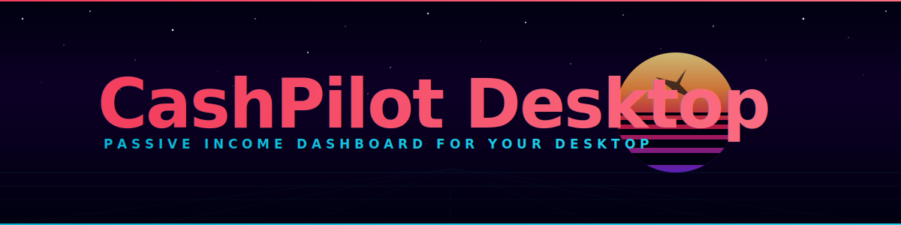

<p align="center">
  
</p>

<p align="center">
  <a href="https://github.com/GeiserX/CashPilot-Desktop/releases/latest"></a>
  <a href="https://github.com/GeiserX/CashPilot-Desktop/releases"></a>
  <a href="https://github.com/GeiserX/CashPilot-Desktop/stargazers"></a>
  <a href="https://github.com/GeiserX/CashPilot-Desktop/blob/main/LICENSE"></a>
</p>

---

## What is CashPilot Desktop?

CashPilot Desktop is a local-first, cross-platform desktop application for deploying and monitoring passive-income and DePIN services. Instead of running CashPilot as a Docker container and accessing it via browser, CashPilot Desktop bundles everything into a single installable app with system tray integration and a guided setup wizard.

It can run in two modes:

- **CashPilot mode** -- Full dashboard with service management, earnings tracking, container deployment, and fleet orchestration
- **Worker Node mode** -- Lightweight agent that connects to an existing CashPilot instance to run services on this machine

Built with [Wails](https://wails.io) (Go + vanilla TypeScript) for a lightweight, cross-platform experience with native performance.

## Features

- **One-click install** -- No Docker knowledge required; the app handles container setup for you
- **System tray (macOS)** -- Runs quietly in the background with quick-access status and earnings summary; menu-bar icon is macOS-only today (Windows/Linux planned)
- **Real-time monitoring** -- Live earnings, service health, container stats, and node uptime
- **Multi-node fleet** -- Aggregate view across your entire CashPilot fleet from a single window
- **Auto-updater** -- Planned (not yet implemented)
- **Guided setup wizard** -- Step-by-step onboarding with Docker detection and installation guidance
- **Cross-platform** -- Native builds for macOS (ARM64), Windows (x64), and Linux (x64)
- **Lightweight** -- Minimal resource usage thanks to native Go backend with webview frontend
- **Secure** -- Credentials encrypted at rest with AES-256-GCM; master key in the OS keychain. Signed/notarized installers are planned.

## Installation

Download the latest release for your platform:

| Platform | Format | Download | Notes |
|----------|--------|----------|-------|
| macOS (Apple Silicon) | `.dmg` | [Download](https://github.com/GeiserX/CashPilot-Desktop/releases/latest) | Unsigned (right-click → Open to bypass Gatekeeper) |
| Windows (x64) | `.exe` (NSIS) | [Download](https://github.com/GeiserX/CashPilot-Desktop/releases/latest) | Unsigned unless a signing cert is configured in CI |
| Linux (Debian/Ubuntu) | `.deb` | [Download](https://github.com/GeiserX/CashPilot-Desktop/releases/latest) | Raw binary (.deb packaging planned) |

### System Requirements

| Requirement | Minimum |
|-------------|---------|
| **Docker** | Docker Desktop (macOS/Windows) or Docker Engine / Podman (Linux) |
| **RAM** | 4 GB (8 GB recommended for multiple services) |
| **Disk** | 2 GB free (more for service containers) |
| **Network** | Residential IP recommended for most services |

## Quick Start

1. **Download and install** CashPilot Desktop for your platform
2. **Launch the app** -- the setup wizard detects Docker/Podman and guides you through installation if needed
3. **Choose your mode** -- CashPilot (full dashboard) or Worker Node (connect to existing instance)
4. **If Worker Node** -- enter your CashPilot instance address and fleet key
5. **Start earning** -- browse the service catalog, deploy containers, and monitor earnings from the system tray

## Supported Services

CashPilot bundles a catalog of 49 passive-income services across multiple categories. A representative selection is shown below.

### Docker-Deployable Services

Services CashPilot can deploy and manage automatically via Docker containers.

| Service | Residential IP | VPS IP | Devices / Acct | Devices / IP | Payout |
|---------|:-:|:-:|:-:|:-:|--------|
| [Anyone Protocol](https://anyone.io) | ✅ | ✅ | Unlimited | 1 | Crypto (ANYONE) |
| [Bitping](https://app.bitping.com) | ✅ | ✅ | Unlimited | 1 | Crypto (SOL) |
| [Earn.fm](https://earn.fm/ref/GEISYB91) | ✅ | ✅ | Unlimited | 1 | Crypto |
| [EarnApp](https://earnapp.com/i/TSMD9wSm) | ✅ | ❌ | 15 | 1 | PayPal, Gift Cards, Wise |
| [Honeygain](https://dashboard.honeygain.com/ref/SERGIB4014) | ✅ | ❌ | 10 | 1 | PayPal, Crypto |
| [IPRoyal Pawns](https://pawns.app?r=19266874) | ✅ | ❌ | Unlimited | 1 | PayPal, Crypto, Bank Transfer |
| [MystNodes](https://mystnodes.co/?referral_code=do7v7YOoBBpbOstKQovX2pUvZYKia4ZhH3QIdNtE) | ✅ | ✅ | Unlimited | Unlimited | Crypto (MYST) |
| [PacketStream](https://packetstream.io/?psr=7xgZ) | ✅ | ❌ | Unlimited | 1 | PayPal |
| [Presearch](https://presearch.com/signup?rid=4872322) | ✅ | ✅ | Unlimited | 1 | Crypto (PRE) |
| [ProxyBase](https://peer.proxybase.org?referral=nXzS3c6iTO) | ✅ | ❌ | Unlimited | 1 | Crypto |
| [ProxyLite](https://proxylite.ru/?r=KMUPRZIZ) | ✅ | ✅ | Unlimited | 1 | Crypto, PayPal |
| [ProxyRack](https://peer.proxyrack.com/ref/mpwiok3xlaxeycnn5znqlg7ipjeutxyxr6xl7vmn) | ✅ | ✅ | 500 | 1 | PayPal, Crypto |
| [Repocket](https://repocket.com/) | ✅ | ❌ | 5 | 2 | PayPal, Crypto |
| [Storj](https://www.storj.io/node) | ✅ | ✅ | Unlimited | 1 \* | Crypto (STORJ) |
| [Traffmonetizer](https://traffmonetizer.com/?aff=2111758) | ✅ | ✅ \*\* | Unlimited | Unlimited | Crypto (USDT), PayPal |
| [URnetwork](https://ur.io/?referral_code=1Q3G19) | ✅ | ✅ | Unlimited | 1 | Crypto |

> \* Storj nodes on the same /24 subnet share data allocation, reducing per-node earnings.
>
> \*\* Traffmonetizer ToS requires residential IP, but VPS nodes are accepted in practice.

### Browser Extension / Desktop Only

These services have no Docker image. CashPilot lists them in the catalog with signup links and earning estimates.

| Service | Residential IP | VPS IP | Devices / Acct | Devices / IP | Payout | Status |
|---------|:-:|:-:|:-:|:-:|--------|--------|
| [Bytelixir](https://bytelixir.com/r/OYEIRE0VSZBZ) | ✅ | ❌ | Unlimited | 1 | Crypto | Active |
| [Dawn Internet](https://dawninternet.com/?code=2QLQV97F) | ✅ | ❌ | Unlimited | 1 | Crypto (DAWN) | Active |
| [Deeper Network](https://deeper.network) | ✅ | ❌ | Unlimited | 1 | Crypto (DPR) | Active |
| [Ebesucher](https://www.ebesucher.com/?ref=geiserx) | ✅ | ✅ | Unlimited | 1 | PayPal | Active |
| [Gradient Network](https://app.gradient.network/signup?referralCode=YSKMY7) | ✅ | ❌ | Unlimited | 1 | Crypto (GRADIENT) | Active |
| [Grass](https://app.grass.io/register?referralCode=kn8FNEPnUr2tMqE) | ✅ | ❌ | Unlimited | 1 | Crypto (GRASS) | Active |
| [Helium](https://helium.com) | ✅ | ❌ | Unlimited | 1 | Crypto (HNT) | Active |
| [Nodepay](https://app.nodepay.ai/register?ref=0wzzyznen64j9zx) | ✅ | ❌ | Unlimited | 1 | Crypto (NC) | Active |
| [Nodle](https://nodle.com) | ✅ | ✅ | Unlimited | 1 | Crypto (NODL) | Active |
| [PassiveApp](https://passiveapp.com/i/bqpC4M) | ✅ | ❌ | Unlimited | 1 | Crypto, PayPal | Active |
| [Sentinel dVPN](https://sentinel.co) | ✅ | ✅ | Unlimited | 1 | Crypto (DVPN) | Active |
| [Spide](https://spide.network/register.html?f3bc51) | ✅ | ❌ | Unlimited | 1 | Crypto | Active |
| [Teneo Protocol](https://dashboard.teneo.pro/?code=CAqef) | ✅ | ❌ | Unlimited | 1 | Crypto (TENEO) | Active |
| [Theta Edge Node](https://thetatoken.org) | ✅ | ✅ | Unlimited | 1 | Crypto (TFUEL) | Active |
| [Titan Network](https://edge.titannet.info/signup?inviteCode=2GKKJ495) | ✅ | ❌ | Unlimited | 1 | Crypto (TNT) | Active |
| [Uprock](https://link.uprock.com/i/33e8492e) | ✅ | ❌ | Unlimited | 1 | Crypto | Active |

### GPU Compute

GPU-intensive computing services. Requires compatible hardware.

| Service | Residential IP | GPU Required | Min Storage | Payout | Status |
|---------|:-:|:-:|:-:|--------|--------|
| [Flux](https://runonflux.io) | ✅ | ❌ | 220GB | Crypto (FLUX) | Active |
| [Golem Network](https://golem.network) | ✅ | ❌ | 20GB | Crypto (GLM) | Active |
| [io.net](https://io.net) | ✅ | ✅ | N/A | Crypto (IO) | Active |
| [Nosana](https://nosana.io) | ✅ | ✅ | 50GB | Crypto (NOS) | Active |
| [Salad](https://salad.io) | ✅ | ✅ | N/A | PayPal, Gift Cards | Active |
| [Vast.ai](https://cloud.vast.ai/?ref_id=452772) | ✅ | ✅ | 100GB | Crypto, Bank Transfer | Active |

> **Note:** Earnings vary widely by location, hardware, and demand.

## CashPilot Desktop vs Web

| Feature | Desktop App | Web (Docker) |
|---------|:-----------:|:------------:|
| Installation | One-click installer | `docker compose up -d` |
| Docker management | Built-in (auto-detects, guides install) | Requires Docker pre-installed |
| System tray integration | macOS only | No |
| Auto-updates | Planned | Manual image pull |
| Background operation | Native OS service | Container must stay running |
| Fleet management | **Yes** | **Yes** |
| Earnings dashboard | **Yes** | **Yes** |
| Target audience | End users, non-technical | Self-hosters, sysadmins |
| Resource usage | ~80 MB RAM | ~80 MB RAM (container only) |

## Architecture

```
CashPilot Desktop (Wails 2.x)
├── Go Backend (app.go, internal/)
│   ├── Container runtime    — Docker/Podman detection, deploy/stop/restart
│   ├── Earnings collectors  — Polls service APIs for earnings
│   ├── internal/exchange    — FX rates (crypto + fiat → display currency)
│   ├── Fleet management     — Multi-node coordination via HTTP
│   ├── fleet_server.go      — Token-auth worker/mobile heartbeat API
│   └── SQLite database      — Config, credentials (OS keychain), earnings history
├── Frontend (vanilla TypeScript + Vite)
│   ├── Dashboard            — Real-time earnings and service status
│   ├── Setup wizard         — Onboarding flow with runtime detection
│   ├── Service catalog      — Browse and deploy services
│   ├── Settings             — Display currency and preferences
│   └── Fleet                — Connected worker/node status
└── Wails Runtime            — Window management, system tray, native bindings
```

The Go backend handles all business logic, container orchestration, and data collection. The TypeScript frontend communicates via Wails bindings (direct Go function calls, no HTTP). State is persisted in a local SQLite database, with credentials encrypted at rest (AES-256-GCM) under a master key held in the OS keychain.

## Development

### Prerequisites

- [Go](https://go.dev/) 1.26.x
- [Node.js](https://nodejs.org/) 26+
- [Wails CLI](https://wails.io/docs/gettingstarted/installation) v2

### Dev Workflow

```bash
wails dev              # Hot-reload dev mode (Go + TypeScript)
go test -race ./...    # Run Go tests
```

### Build from Source

```bash
git clone https://github.com/GeiserX/CashPilot-Desktop.git
cd CashPilot-Desktop
wails build
```

### Running Tests

```bash
make test
```

## FAQ

**How is this different from the CashPilot Docker container?**

It's the same passive-income management system, but packaged as a desktop app instead of a Docker container. You get system tray integration, auto-updates, a guided Docker installation wizard, and a native window -- no need to manage Docker yourself or access a web UI via browser.

**Do I still need Docker installed?**

Yes. CashPilot Desktop manages Docker containers for you, but Docker (or Podman) must be installed. The setup wizard detects if a compatible runtime is missing and guides you through installing Docker Desktop (macOS/Windows) or Docker Engine (Linux).

**How much can I earn?**

Earnings vary widely based on location, ISP, number of devices, and which services you run. The dashboard tracks your actual earnings over time so you can optimize your setup.

**Is it safe?**

All service containers run isolated via Docker. Credentials are stored in the OS keychain (macOS Keychain, Windows Credential Manager, Linux Secret Service). The app communicates only with localhost and the services you choose to deploy. No telemetry, no analytics, no data leaves your machine unless a service requires it.

**What happens if the app crashes?**

Docker containers continue running independently -- they don't stop when CashPilot Desktop is closed. Reopening the app reconnects to your running containers and resumes monitoring.

**Can I run CashPilot Desktop on multiple machines?**

Yes. Use **Worker Node** mode on additional machines -- they connect to your main CashPilot instance (either Desktop or Docker) and appear in the fleet dashboard. Each worker runs its own set of services and reports status back.

## Disclosure

> This project's service catalog may contain affiliate/referral links. If you sign up through them, the project maintainer may earn a small commission at no extra cost to you. This helps support development.

## Ecosystem

| Project | Type | Description |
|---------|------|-------------|
| [CashPilot](https://github.com/GeiserX/CashPilot) | Backend | Multi-service passive income aggregator and fleet manager |
| [CashPilot-android](https://github.com/GeiserX/CashPilot-android) | Android Agent | Monitoring agent for passive income apps on Android |
| [cashpilot-mcp](https://github.com/GeiserX/cashpilot-mcp) | MCP Server | Monitor earnings from AI assistants via Model Context Protocol |
| [cashpilot-ha](https://github.com/GeiserX/cashpilot-ha) | Home Assistant | Earnings and service status sensors for your smart home |
| [n8n-nodes-cashpilot](https://github.com/GeiserX/n8n-nodes-cashpilot) | n8n Node | Automate earnings workflows in n8n |

## License

[GPL-3.0](LICENSE) -- Sergio Fernandez, 2026
