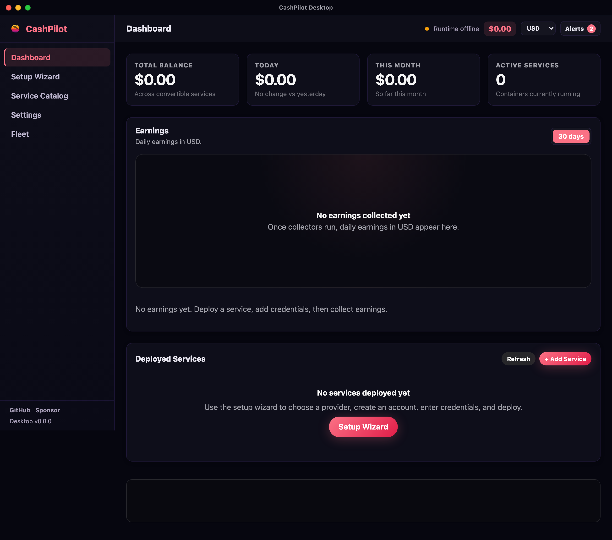

  

  
  
  
  
  

CashPilot Desktop is a local-first desktop app for macOS (Apple Silicon), Windows and Linux that deploys and monitors passive-income and DePIN services. It packs CashPilot into one app with a system tray and a setup wizard, so you open an app instead of running the CashPilot container and a browser; the earning services themselves still run in Docker or Podman. It runs either as the full CashPilot dashboard or as a Worker Node that joins an existing CashPilot instance.

  

## Features

- **One-click install** -- No Docker knowledge required; the app handles container setup for you
- **System tray (macOS)** -- Runs quietly in the background with quick-access status and earnings summary; menu-bar icon is macOS-only today (Windows/Linux planned)
- **Real-time monitoring** -- Live earnings, service health, container stats, and node uptime
- **Multi-node fleet** -- Aggregate view across your entire CashPilot fleet from a single window
- **Guided setup wizard** -- Step-by-step onboarding with Docker detection and installation guidance
- **Cross-platform** -- Native builds for macOS (ARM64), Windows (x64), and Linux (x64)
- **Lightweight** -- Minimal resource usage thanks to native Go backend with webview frontend
- **Secure** -- Credentials encrypted at rest with AES-256-GCM; master key in the OS keychain. From the first release after v0.20.5 the macOS build is signed with a Developer ID certificate and notarized by Apple; Windows signing is planned.

## Quick start

1. Download the app for your platform from the [latest release](https://github.com/GeiserX/CashPilot-Desktop/releases/latest). Docker or Podman must be installed; the wizard helps if it is missing.
2. Launch the app and pick a mode: CashPilot (full dashboard) or Worker Node (enter your CashPilot address and fleet key).
3. Browse the service catalog, deploy containers, and watch earnings from the dashboard or the tray.

Platform notes, system requirements and the full walkthrough are in [Getting started](docs/getting-started.md).

## Supported services

CashPilot bundles a catalog of 39 active passive-income services across multiple categories (the catalog also carries 11 retired entries, which the app hides and refuses to deploy). Some links below are affiliate/referral links -- see the [disclosure](docs/services.md#disclosure). Read [how bandwidth-sharing works](docs/services.md#before-you-start-how-bandwidth-sharing-works) before you opt in; per-service limits, payouts and caveats are in [docs/services.md](docs/services.md).

- **Docker-deployable:** [Anyone Protocol](https://anyone.io), [Bitping](https://app.bitping.com), [Earn.fm](https://earn.fm/ref/GEISYB91), [EarnApp](https://earnapp.com/i/TSMD9wSm), [Honeygain](https://dashboard.honeygain.com/ref/SERGIB4014), [IPRoyal Pawns](https://pawns.app?r=19266874), [MystNodes](https://mystnodes.co/?referral_code=do7v7YOoBBpbOstKQovX2pUvZYKia4ZhH3QIdNtE), [PacketStream](https://packetstream.io/?psr=7xgZ), [ProxyBase](https://peer.proxybase.org?referral=nXzS3c6iTO), [ProxyBase Markets](https://proxybase.xyz?referral=nXzS3c6iTO), [ProxyLite](https://proxylite.ru/?r=KMUPRZIZ), [ProxyRack](https://peer.proxyrack.com/ref/mpwiok3xlaxeycnn5znqlg7ipjeutxyxr6xl7vmn), [Repocket](https://repocket.com/), [Storj](https://storj.dev/node/get-started/setup), [Traffmonetizer](https://traffmonetizer.com/?aff=2111758), [URnetwork](https://ur.io/?referral_code=1Q3G19)
- **Browser extension / desktop only:** [Bytebenefit](https://bytebenefit.io/invited?ref=Brl4z3), [Bytelixir](https://bytelixir.com/r/OYEIRE0VSZBZ), [Dawn Internet](https://dawninternet.com/?code=2QLQV97F), [Deeper Network](https://deeper.network), [Ebesucher](https://www.ebesucher.com/?ref=geiserx), [Gradient Network](https://app.gradient.network/signup?referralCode=YSKMY7), [Grass](https://app.grass.io/register?referralCode=kn8FNEPnUr2tMqE), [Helium](https://helium.com), [Nodepay](https://app.nodepay.ai/register?ref=0wzzyznen64j9zx), [Nodle](https://nodle.com), [PassiveApp](https://passiveapp.com/i/bqpC4M), [Sentinel dVPN](https://sentinel.co), [Spide](https://spide.network/register.html?f3bc51), [Teneo Protocol](https://dashboard.teneo.pro/?code=CAqef), [Theta Edge Node](https://thetatoken.org), [Titan Network](https://edge.titannet.info/signup?inviteCode=2GKKJ495), [Uprock](https://link.uprock.com/i/33e8492e)
- **GPU compute:** [Flux](https://runonflux.io), [Golem Network](https://golem.network), [io.net](https://io.net), [Nosana](https://nosana.io), [Salad](https://salad.io), [Vast.ai](https://cloud.vast.ai/?ref_id=452772)

## Documentation

- [Getting started](docs/getting-started.md): modes, downloads, system requirements, Desktop vs Web
- [Configuration](docs/configuration.md): every setting and its default, Worker Node pairing, where secrets live
- [Usage](docs/usage.md): a tour of every screen
- [Supported services](docs/services.md): bandwidth-sharing explained, per-service limits and payouts, disclosure
- [How it works](docs/how-it-works.md): the full design, grounded in the code
- [FAQ](docs/faq.md): earnings, safety, Docker, crashes, several machines
- [Development](docs/development.md): prerequisites, dev workflow, build, tests

## Related projects

| Project | Type | Description |
|---------|------|-------------|
| [CashPilot](https://github.com/GeiserX/CashPilot) | Backend | Multi-service passive income aggregator and fleet manager |
| [CashPilot-android](https://github.com/GeiserX/CashPilot-android) | Android Agent | Monitoring agent for passive income apps on Android |
| [cashpilot-mcp](https://github.com/GeiserX/cashpilot-mcp) | MCP Server | Monitor earnings from AI assistants via Model Context Protocol |
| [cashpilot-ha](https://github.com/GeiserX/cashpilot-ha) | Home Assistant | Earnings and service status sensors for your smart home |

## License

[GPL-3.0-or-later](LICENSE). Sergio Fernandez, 2026.
