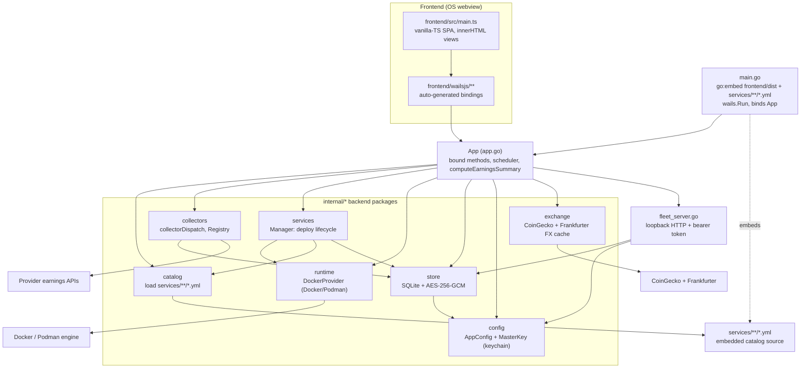
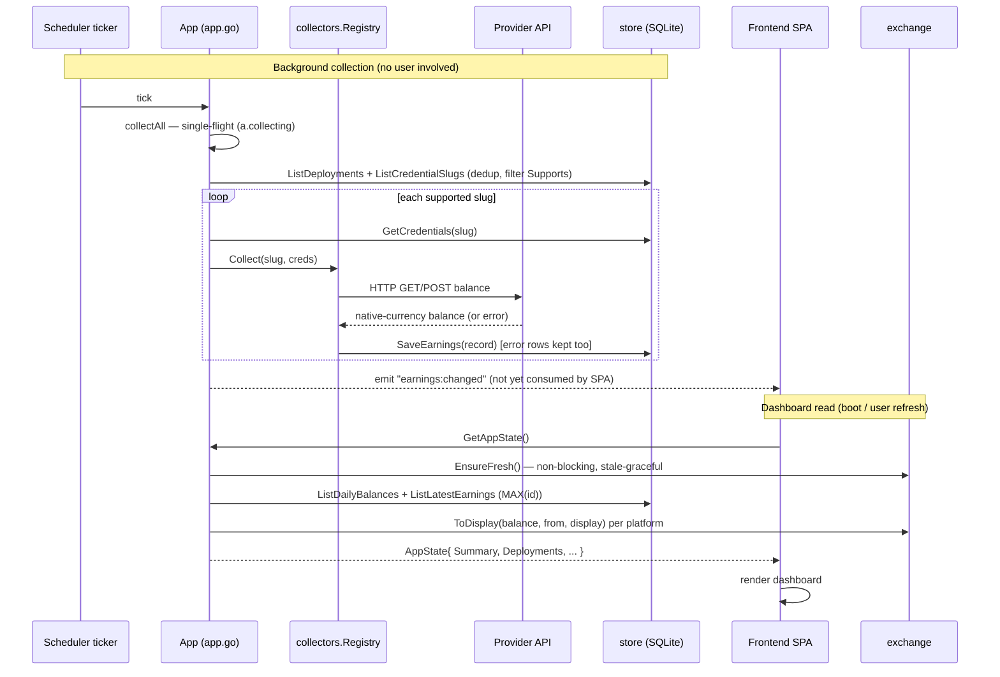

# CashPilot Desktop — Architecture

This document describes how CashPilot Desktop is put together, grounded in the
code as it stands (`v0.6.0`). It is meant to get a new contributor productive:
what each piece does, how the pieces are wired, and where the load-bearing
decisions live. Symbol references use `path/file.go:Symbol`.

---

## 1. Overview

CashPilot Desktop is a local-first, cross-platform desktop application for
deploying and monitoring passive-income and DePIN ("Decentralized Physical
Infrastructure Network") services — bandwidth-sharing, storage, and GPU/CPU
compute providers that pay you for idle machine resources. It runs those
providers as containers on a Docker-compatible runtime, tracks each one's
earnings, converts them into a single display currency, and shows the result on
a dashboard.

It is built with [Wails v2](https://wails.io): a **Go backend** and a
**vanilla-TypeScript frontend** share a single native process. Wails renders the
frontend in the OS webview and exposes the backend's methods to JavaScript
through **auto-generated bindings**, so the UI calls Go functions as if they were
async TypeScript functions — there is no HTTP server between them.

Top-level runtime picture:

- `main.go` embeds the built frontend and the service catalog, configures the
  Wails window, and binds a single `App` value (`app.go`) whose exported methods
  become the frontend API.
- On startup the `App` opens the local SQLite store, loads the embedded catalog,
  connects to the container runtime, starts a background earnings-collection
  scheduler, and starts a loopback HTTP server for external worker/mobile
  heartbeats.
- All persistent state lives in a single local SQLite database in the OS
  app-data directory. There is no cloud backend; the app talks directly to the
  container runtime and to each provider's own API for earnings.

Key technology versions (from `go.mod`, `wails.json`, `frontend/package.json`):
Go 1.26, Wails v2.12.0, `modernc.org/sqlite` v1.51.0 (pure-Go, no cgo for the
DB), Docker SDK `github.com/docker/docker` v28.5.2, Vite 8 + TypeScript 6 (no UI
framework).

---

## 2. Component map

Nodes are real files/packages. Edges show construction/`use` wiring established
in `app.go:Startup`.



---

## 3. Backend packages

### `main.go` — bootstrap

Embeds three asset sets with `go:embed`: `all:frontend/dist` (the built SPA),
`services/**/*.yml` (the catalog — shipped *inside* the binary), and the app/tray
icons. It configures a frameless, dark, 1200x800 Wails window and binds one
`App` value so every exported `App` method is reachable from the frontend. It
wires the three Wails lifecycle hooks to `App.Startup`, `App.DomReady`,
`App.Shutdown`.

### `app.go` — the `App` struct (the backend's public surface)

`App` (`app.go:App`) is the single Wails-bound type; its exported methods are the
whole frontend API (`GetAppState`, `DeployService`, `CollectService`,
`SaveSettings`, `GetFleetState`, …). It owns handles to every subsystem:
`cfg`, `catalog`, `store`, `runtime`, `services`, `collectors`, `exchange`,
`fleetAPI`.

- **`Startup`** (`app.go:Startup`) constructs everything in dependency order:
  `config.NewManager` → `store.Open` → `catalog.LoadEmbedded(serviceFiles)` →
  `runtime.NewDockerProvider` → `services.NewManager` → `collectors.NewRegistry`
  → `exchange.NewService`. It then kicks a best-effort initial FX fetch plus a
  periodic refresher, ensures the fleet API key exists, starts the fleet HTTP
  server, and starts the collection scheduler. A failure in a core dependency
  emits an `app:error` event and aborts startup; an FX fetch failure never blocks
  startup (the summary is stale-graceful).
- **`DomReady`** (`app.go:DomReady`) shows the window, repositions it onto the
  primary screen, and installs the tray icon. It deliberately does **not**
  reassign `a.ctx` — binding goroutines read `a.ctx` concurrently, so a second
  write would race under `-race`.
- **`Shutdown`** (`app.go:Shutdown`) stops the scheduler (joining the loop so no
  in-flight collect writes to a closing DB), closes the fleet server, then closes
  the store — in that order.
- **`GetAppState`** (`app.go:GetAppState`) is the frontend's primary read: it
  bundles config, runtime status, the visible catalog, deployments, latest
  earnings, history, install guides, notifications, supported currencies, and the
  computed `EarningsSummary` into one `AppState`.
- **`computeEarningsSummary`** — see §5.
- **`emitEvent`** (`app.go:emitEvent`) wraps Wails `EventsEmit` but only fires
  when `a.ctx` carries the Wails `"events"` value. Wails' `EventsEmit` calls
  `log.Fatalf` if the context lacks that value (the case in tests that inject a
  plain `context.Background()`), so this guard lets background collection be
  exercised in tests without killing the process. Emitted events:
  `earnings:changed`, `deployment:changed`, `app:error`.

#### The scheduler (background collection)

The app is "passive": balances refresh on a timer without the user clicking
Collect. The scheduler lives entirely in `app.go`:

- **`startScheduler`/`runScheduler`** (`app.go:runScheduler`) launch a goroutine
  that runs `collectAll` once immediately, then on every `time.Ticker` tick.
  The interval is a *parameter* (defaulting to 60 min via `collectInterval`) so
  tests can inject a short cadence. `runScheduler` cancels any prior loop first;
  `schedCancel`/`schedDone` are guarded by `schedMu` because `Startup`,
  `SaveSettings`, and `Shutdown` touch them from different goroutines. Changing
  the interval in Settings restarts the loop immediately.
- **`collectAll`** (`app.go:collectAll`) runs one full cycle. A single-flight
  guard — `a.collecting` (`atomic.Bool`, compare-and-swap) — means overlapping
  triggers (the ticker, a post-deploy kick, a manual refresh) never stack; a run
  already in progress is skipped, not queued. It collects the **deduplicated
  union** of *deployed slugs* (`store.ListDeployments`) and *slugs with saved
  credentials* (`store.ListCredentialSlugs`), filtered to those the collector
  registry `Supports`. Unioning the credential set is what lets **imageless**
  services (e.g. `vast-ai`, `salad`, `grass`) — which never create a deployment
  row — participate in scheduled collection instead of only on a manual click. A
  failing collector never aborts the batch (its error is persisted as an earnings
  row); one `earnings:changed` event is emitted after the batch.
- **`collectOne`** (`app.go:collectOne`) is the fire-and-forget single-service
  variant used for the post-deploy balance fetch in `DeployService`.

### `fleet_server.go` — worker/mobile heartbeat API

A small `net/http` server (`fleet_server.go:fleetAPIServer`) that lets external
CashPilot workers or mobile companions on the LAN report in. It binds to
`config.FleetBindAddress:FleetPort` — **`127.0.0.1:8085` by default** — so it is
loopback-only unless the user explicitly changes the bind address. Two routes:

- `GET /api/health` — unauthenticated liveness probe.
- `POST /api/workers/heartbeat` — bearer-token-authenticated. The body is capped
  at 1 MiB (`http.MaxBytesReader`); the token is checked with
  `subtle.ConstantTimeCompare` against the generated `FleetAPIKey`
  (`fleet_server.go:validFleetBearer`). A valid heartbeat upserts a
  `fleet_devices` row (`store.UpsertFleetHeartbeat`), classifying mobile vs worker
  from the reported OS/name.

Note: the desktop **is** the fleet server. "Workers" are separate external
processes that heartbeat in; the desktop app itself always runs the full
dashboard.

### `internal/catalog` — the service catalog

Loads every `services/**/*.yml` into `[]catalog.Service`
(`internal/catalog/catalog.go:Service`). `LoadEmbedded` walks the embedded FS
handed in from `main.go`; it falls back to an on-disk `Load` (used by `go test`
and dev when the embed is empty). Files beginning with `_` (e.g. `_schema.yml`)
and files missing `slug`/`name` are skipped. Two derived fields matter:
`SourcePath` and `ManualOnly` — a service is **manual-only** when its
`docker.image` is empty (`svc.Docker.Image == ""`), meaning it is tracked but
never containerized. `ListVisible` hides `dead`/`broken` services; `Get` resolves
a slug. The catalog currently holds 49 service definitions across four categories
(`bandwidth`, `depin`, `storage`, `compute`).

**Image-pin enforcement (fail-closed test).** `image_pin_test.go` loads the real
on-disk catalog and fails if any *live* service ships a `docker.image` that is not
pinned to an immutable digest (`@sha256:`). Retired services
(`dead`/`dropped`/`broken`) are exempt (`image_pin_helpers_test.go:isPinExempt`).
The test also asserts at least 20 services loaded, so a broken loader can't turn
the check into a silent no-op. This is the enforcement gate for the repo rule
"external images: pinned digests, never `:latest`".

### `internal/collectors` — earnings collectors (the dispatch pattern)

`collectors.Registry` (`internal/collectors/collectors.go:Registry`) fetches a
service's current balance from that provider's own API/dashboard. The design
centers on **one map as the single source of truth**:

```go
var collectorDispatch = map[string]collectorFunc{
    "anyone-protocol": (*Registry).collectAnyone,
    "vast-ai":         (*Registry).collectVast,
    ... // 16 entries total
}
```

- **`Supports(slug)`** reports membership in `collectorDispatch`.
- **`Collect(ctx, slug, creds)`** dispatches through the same map; an unlisted
  slug yields a "collector … is not ported yet" error.

Because both read the one map, they can never drift: a slug either has a
collector or it does not. Every path — success or error — ends by persisting a
`store.EarningsRecord` via `store.SaveEarnings`, so a failed collect still writes
an *error row* (currency defaults to `USD`, balance `0`, `Error` set). That error
row is what the dashboard's "needs attention" chips and notifications read.

Collectors return **native-currency** balances (USD, a crypto token like `MYST`
or `ANYONE`, or reward points like `GRASS`) — they do **not** convert to fiat;
conversion happens later at read time (§5). Example:
`collectVast` (`collectors.go:collectVast`) calls Vast.ai's machine-earnings
endpoint and reduces the response to one USD figure via `vastEarningsUSD`
(summing per-machine earnings, falling back through account total/balance/summary
— everything absent means "earned nothing yet", not an error). `collectAnyone`
emits a stable `ANYONE` token count and lets the exchange layer price it, rather
than flipping currency on a live price fetch (a flip corrupted per-day accrual,
since the summary collapses each platform to a single currency).

All HTTP goes through shared helpers (`doRaw`/`doJSON`) with a 30 s client
timeout and an 8 MiB response cap (mirroring the fleet server's inbound defense).

**Parity is test-guarded.** `TestCatalogCollectorParity`
(`collectors_test.go`) fails if any *automatable* catalog service
(`collector.type` = `api`/`scrape`/`auto`, status live) has neither a collector
nor an explicit `knownUnported` allowlist entry — and also prunes the allowlist
when a slug gains a collector or disappears. `TestRegistrySupports` pins the
`Supports` contract. Together they stop a new automatable service from silently
shipping with no way to collect its earnings.

### `internal/store` — SQLite persistence + encryption

See §4. Owns the DB connection and the AES-256-GCM cipher; every table access is
a method here.

### `internal/config` — app config + master key

`config.Manager` (`internal/config/config.go`) reads/writes `config.json` in the
OS app-data directory (`~/Library/Application Support/com.cashpilot.desktop` on
macOS, `%APPDATA%\CashPilot Desktop` on Windows, `$XDG_DATA_HOME/cashpilot-desktop`
on Linux; overridable via `CASHPILOT_DESKTOP_DATA_DIR`). `applyDefaults` fills
safe defaults, notably **`FleetBindAddress = 127.0.0.1`** (loopback),
`FleetPort = 8085`, `CollectIntervalMinutes = 60`, `DisplayCurrency = USD`.

`config.MasterKey` (`config.go:MasterKey`) resolves the 32-byte credential key:
first from the OS keychain via `github.com/zalando/go-keyring`; else from a
`0600` `.credential_key` file next to the DB (migrating it into the keyring if
possible); else it generates a new random key and stores it in the keyring, only
falling back to the file if no keyring is available. There is **no**
`internal/keyring` package — key handling lives entirely here.

### `internal/exchange` — FX rate cache

See §5. `exchange.Service` caches crypto→USD (CoinGecko) and USD→fiat
(Frankfurter) rates, stale-gracefully, and is injectable/concurrency-safe.

### `internal/runtime` — Docker/Podman abstraction

`runtime.Provider` (`internal/runtime/runtime.go:Provider`) is the container
interface; `DockerProvider` is the only implementation. It talks to the engine
through the Docker Go SDK with `client.FromEnv` + API-version negotiation
(`runtime.go:dockerClient`), which is what makes it work against **both Docker and
Podman** (Podman exposes a Docker-compatible API). Responsibilities:

- **`Status`** probes the runtime, reports a friendly message when it's absent or
  not running, and lists which CLIs exist (`docker`, `podman`, `colima`,
  `limactl`, `nerdctl`) via `detectTools`.
- **`Deploy`** pulls the image, then creates+starts a container named
  `cashpilot-<slug>` with CashPilot labels (`cashpilot.managed=true`, etc.),
  `unless-stopped` restart policy, and env/ports/volumes/caps from the catalog
  entry. Bind vs named volumes are distinguished by `isNamedVolume`.
- **`Stop`/`Start`/`Restart`/`Remove`/`Logs`/`List`** operate by container name.
  `Remove` also deletes the container's **named** volumes (host bind-mounts are
  left untouched); `List` filters to managed containers and computes live CPU%/MEM
  from a one-shot stats read.
- **`InstallGuides`** returns per-OS runtime-install instructions for onboarding.
  **`ManagedRuntimeRoadmap`** describes a *future* managed-VM appliance — it is a
  roadmap payload, not an implemented runtime.

### `internal/services` — deployment lifecycle orchestration

`services.Manager` (`internal/services/manager.go`) sits between the `App` and the
runtime+store. `Deploy` validates required credentials (`validateRequired`),
refuses manual-only services, records progress breadcrumbs into `runtime_events`,
asks the runtime to deploy, then upserts a `deployments` row. `Stop`/`Start`/
`Restart`/`Remove` mutate the runtime and reconcile the stored status. `Refresh`
reconciles stored deployments against what the runtime actually reports — but
**only prunes stale rows when the runtime returned at least one container**, so a
different active Docker context (an empty-but-error-free list) never wipes the
dashboard.

---

## 4. Data model

State is one SQLite file (`cashpilot-desktop.db`) opened with `SetMaxOpenConns(1)`
and `journal_mode=WAL` (`internal/store/store.go:Open`, `:migrate`). Tables:

| Table | Purpose | Notable columns |
|-------|---------|-----------------|
| `credentials` | Per-service secrets | `slug` (PK), `value` (AES-256-GCM ciphertext, base64), `updated_at` |
| `deployments` | One row per managed container | `slug` (PK), `container_id`, `image`, `status`, `runtime`, `cpu_percent`, `memory_mb`, timestamps |
| `earnings` | Append-only balance log | `id` (AUTOINCREMENT), `platform`, `balance`, `currency`, `error`, `created_at` |
| `runtime_events` | Append-only deploy/lifecycle breadcrumbs | `id`, `slug`, `event`, `detail`, `created_at` |
| `fleet_devices` | Registered workers/mobiles | `id`, `name`, `kind`, `endpoint`, `os`, `arch`, `status`, `services` (JSON), `last_seen` |

**Credentials at rest.** `SaveCredentials` JSON-encodes the value map, seals it
with AES-256-GCM (`store.go:encrypt` — random 12-byte nonce prepended to the
ciphertext, base64-encoded), and upserts by slug. The AEAD is built from
`config.MasterKey` (§3). `runtime_events` is currently **write-only** — an audit
trail written by the services manager with no in-app reader yet.

**Migrations are forward-only.** `migrate()` is a single batch of idempotent
`CREATE TABLE IF NOT EXISTS` statements run on every `Open`. There are no down
migrations and no version table; schema evolution means extending this batch.

**Why `ListLatestEarnings` selects by `MAX(id)`, not `MAX(created_at)`.**
`earnings.created_at` is stored as `RFC3339Nano`, whose fractional-second part is
*variable length* and omitted entirely when zero. A lexicographic
`MAX(created_at)` therefore mis-orders rows written in the same second: `"…:00Z"`
sorts **above** `"…:00.5Z"` because the character `'Z'` is greater than `'.'`.
Picking the newest row by string-max `created_at` can thus return a stale row.
The `earnings.id` column is a monotonic `AUTOINCREMENT`, so `MAX(id)` is the
correct, deterministic "last written wins" key. `ListLatestEarnings`
(`store.go:ListLatestEarnings`) and `ListDailyBalances`
(`store.go:ListDailyBalances`, latest **successful** row per platform+day) both
use `MAX(id)` for this reason. `ListLatestEarnings` intentionally keeps error
rows (the dashboard needs to show failures); `ListDailyBalances` filters
`error = ''`.

---

## 5. Earnings & FX pipeline

Balances are stored per service as **cumulative lifetime totals** in native
currency. Turning that into a single-currency dashboard with per-day accrual is a
read-time computation, split across `internal/exchange` and
`app.go:computeEarningsSummary`.

**The exchange service** (`internal/exchange/exchange.go`) caches two rate tables:
crypto→USD from CoinGecko (`fetchCrypto`, mapping token codes like `MYST`,
`ANYONE`, `STORJ` to CoinGecko ids) and USD→fiat from Frankfurter (`fetchFiat`,
seeding `USD = 1.0`). Both are free/no-key. The cache is **stale-graceful**:
`Refresh` only replaces the cache when *both* fetches succeed, so a failed refresh
keeps the last good rates. `EnsureFresh` is **non-blocking** — when the cache is
older than `CacheTTL` (15 min) it kicks a single-flight background refresh and
returns immediately, so the awaited dashboard path never stalls on ~30 s of
sequential HTTP GETs. `Stale` reports true after `StaleThreshold` (30 min)
without a successful refresh. Conversion helpers `ToUSD`/`FromUSD`/`ToDisplay`
route through USD; `Convertible` and `IsPoints` classify a currency — reward
"points" (`PointsCurrencies`, currently `GRASS`) are non-convertible **by
intent**, so a token that is merely momentarily unpriced (a rate outage) is never
misclassified as a point.

**`computeEarningsSummary`** (`app.go:computeEarningsSummary`) builds the
dashboard view:

- Reads per-platform cumulative daily balances (`ListDailyBalances`) into
  `day → balance` maps and carries the latest balance forward across gaps
  (`asOf`).
- **Total / Points** come from each platform's *latest* cumulative balance: a
  declared point is surfaced natively and never summed; any other currency is
  added to the fiat total when it can be priced now; a non-points currency that
  can't be priced right now is dropped from the total and flags `RatesStale`.
- **Today / Month / day-over-day** figures are *per-platform deltas* between two
  days, each clamped at 0 and converted to the display currency, then summed
  (`platformDelta` / `sumDelta`). A platform whose baseline predates the fetch
  window contributes 0 rather than dumping its whole lifetime balance into one
  day's earnings.
- **Breakdown** is every service's latest row (including error rows), with cashout
  progress computed only when the balance currency matches the cashout currency.

The frontend renders `AppState.Summary`. It calls `GetAppState` on boot and after
user actions (deploy/collect/refresh/currency change); it does **not** currently
subscribe to the backend's `earnings:changed`/`deployment:changed` events, so a
scheduled background collection surfaces on the *next* `GetAppState` read.

One collection cycle plus a subsequent dashboard read:



---

## 6. Security

- **Credentials encrypted at rest.** Service secrets are AES-256-GCM-sealed in
  the `credentials` table (`store.go:encrypt`). The 32-byte master key is held in
  the **OS keychain** (macOS Keychain / Windows Credential Manager / Linux Secret
  Service) via `config.MasterKey`.
- **Keyring fallback (stated honestly).** On a host with no Secret Service (e.g.
  headless Linux) the key falls back to a `0600` `.credential_key` file next to
  the DB. In that mode "encrypted at rest" only protects against *another user*
  on the machine, not against anyone who can read the app-data directory. See
  `SECURITY.md`.
- **Image digest pinning.** Every live service image must be pinned to an
  immutable `@sha256:` digest; this is enforced fail-closed by
  `image_pin_test.go` (retired services exempt). Deploys pull exactly that digest.
- **Loopback-default fleet API with token auth.** The worker/mobile HTTP server
  binds `127.0.0.1` by default; the heartbeat route requires a bearer token
  compared in constant time, with a 1 MiB request-body cap. Exposing it to the
  LAN requires deliberately setting the bind address to `0.0.0.0`.
- **Frontend output escaping.** The SPA templates via `innerHTML`, so all
  interpolated values pass through `escapeHtml`, and currency codes are stripped
  to `[A-Z0-9]` before hitting unescaped balance sinks (`main.ts:formatBalance`).

**Current limitations (honest):** installers are **unsigned** today — macOS
builds are not codesigned/notarized (right-click → Open to bypass Gatekeeper),
and Windows binaries are signed only if a `WINDOWS_SIGN_CERT` secret is present in
CI. Signing/notarization is planned, not shipped. The auto-updater is likewise
planned only.

---

## 7. Build, test & release

**Local development.**

```bash
wails dev          # hot-reload dev (Go backend + Vite frontend at :5173)
wails build        # production build into build/bin
go test -race ./...
```

**PR / push CI** (`.github/workflows/ci.yml`) runs on **`ubuntu-latest`**:
`go build ./...`, `go vet ./...`, then `go test -race -covermode=atomic
-coverprofile=coverage.out ./...`, uploading coverage to Codecov. This is where
the parity and image-pin gates run.

**Tagged releases** (`.github/workflows/desktop-release.yml`, on `v*` tags) build
on the **free GitHub-hosted runners** — `macos-latest` (darwin-arm64),
`ubuntu-latest` (linux-amd64), `windows-latest` (windows-amd64) — via
`wails build`, then a `publish` job attaches the artifacts to a GitHub Release.
Windows binaries are signed only when `WINDOWS_SIGN_CERT` is configured;
otherwise **all installers ship unsigned**.

---

## 8. Frontend

The frontend is a single-file **vanilla-TypeScript SPA** built with **Vite** —
no React/Vue/Svelte, no charting library (`frontend/package.json` has zero runtime
dependencies). All views live in `frontend/src/main.ts` as functions that build
HTML strings and assign them to `root.innerHTML`, then wire event listeners by
`querySelectorAll`. Views: onboarding/welcome, dashboard, setup wizard, catalog,
settings, fleet. The earnings chart is hand-rolled inline SVG
(`main.ts:renderEarningsChart`); the synthwave background is inline SVG too.

The frontend calls the Go backend through **auto-generated Wails bindings** in
`frontend/wailsjs/`:

- `frontend/wailsjs/go/main/App.{d.ts,js}` — one function per exported `App`
  method (`GetAppState`, `DeployService`, `CollectService`, …).
- `frontend/wailsjs/go/models.ts` — TypeScript mirrors of the Go structs
  (`catalog.Service`, `store.EarningsRecord`, `main.AppState`, …).
- `frontend/wailsjs/runtime/**` — window controls and the events API.

These files are regenerated by `wails` from the Go types and bindings; **never
hand-edit `frontend/wailsjs/`** — change the Go signature/struct and rebuild. The
hand-written `frontend/src/wails.d.ts` re-exports the model types the SPA uses.

Output safety and formatting: every interpolated string is run through
`escapeHtml`; `formatBalance` uses `Intl.NumberFormat` for ISO currencies and
falls back to `"1234.00 CODE"` for reward tokens (`MYST`, `GRASS`) that
`Intl.NumberFormat` rejects.
