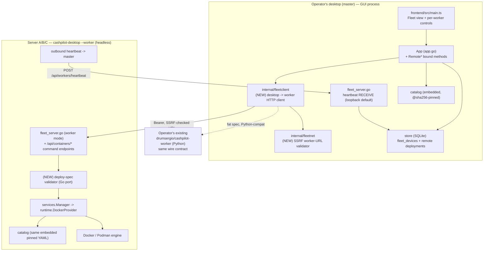

# CashPilot Desktop — Remote Multi-Server Deploy: Architecture & Implementation Plan

> Status: **design** (drives the implementation PRs; no code yet).
> Grounded in the code as it stands on branch `chore/v0.9.0`. Symbol references use `path/file.go:Symbol` and `path/file.py:line`.
> Companion docs: [`docs/ARCHITECTURE.md`](ARCHITECTURE.md), [`ROADMAP.md`](../ROADMAP.md) (Milestone 3), [`docs/desktop-master-plan.md`](desktop-master-plan.md) (Phase 7).

---

## 1. The gap, in one paragraph

CashPilot Desktop is a Wails + Go GUI that manages **only its own local Docker socket**. Its fleet server (`fleet_server.go`) is **heartbeat-RECEIVE only**: remote workers and mobiles POST `/api/workers/heartbeat`, the desktop records their presence (`store.UpsertFleetHeartbeat`, `store.ListFleetDevices`), and that is the end of the relationship. The desktop **cannot deploy to, stop, restart, remove, or read logs from any remote machine.** Every lifecycle method the GUI calls — `App.DeployService`, `StopService`, `StartService`, `RestartService`, `RemoveService`, `GetLogs` (`app.go:774-856`) — runs against the **local** runtime through `services.Manager` (`internal/services/manager.go`). The operator runs this app on three home servers and drives each one separately; the single biggest missing capability is **managing all of them from one desktop**.

The production original — CashPilot (Python/FastAPI, `/Users/sergio/repos/personal/CashPilot`) — already solves this: a **UI** container proxies deploy/stop/restart/remove/logs commands to per-server **worker** containers over an authenticated, SSRF-guarded channel, and each worker runs a hardened deploy-spec validator before touching Docker. This document ports that capability to the Desktop, reusing the Desktop's existing catalog, runtime, and bearer-token plumbing, and adapting the security-critical parts **verbatim**.

This is [`ROADMAP.md`](../ROADMAP.md) **Milestone 3 → "Remote deploy from master to this Desktop node"** and [`docs/desktop-master-plan.md`](desktop-master-plan.md) **Phase 7 → "the desktop can deploy to a connected worker."**

### A tension to reconcile up front

`docs/desktop-master-plan.md:94` lists *"Multi-user auth, RBAC, sessions, **SSRF worker policy**, fleet-key"* under **"Drop — server-only (single local user)."** That call was correct **for a heartbeat-receive-only desktop**: with no outbound requests, there is no SSRF surface, and with one in-process local operator there are no browser sessions to gate.

The moment we add the **outbound command channel** that the same plan schedules in Phase 7 (`desktop-master-plan.md:113`), **the SSRF surface reappears** — the desktop now makes HTTP requests to a worker `url` that the worker itself reported in a heartbeat (attacker-influenceable) or that the operator typed. So this design keeps the "drop" for the parts that are genuinely server-only (multi-user **RBAC**/sessions — `deps.py:38-57`) and **re-introduces the SSRF worker-URL policy and the deploy-spec validator**, because they guard the outbound capability specifically, not the multi-user web UI. This is not a contradiction of the plan; it is the plan's Phase 7 done safely.

**What the Desktop legitimately drops** (server-only, multi-user web concerns):
- `_require_auth_api` / `_require_writer` / `_require_owner` (`deps.py:38-57`) — browser session RBAC. The Desktop's caller is the local operator via in-process Wails bindings; there is no untrusted browser user to authorize.

**What the Desktop MUST keep / port** (machine-to-machine concerns that the outbound channel creates):
- The **SSRF worker-URL validator** (`main.py:792-918`).
- The **deploy-spec validator** (`worker_api.py:288-324`).
- The **constant-time bearer** auth, both directions (already present: `fleet_server.go:136-144`).

---

## 2. Recommended architecture (the decisions)

### 2.1 Worker model — RECOMMENDATION: a headless `--worker` mode of the same Desktop binary, wire-compatible with the existing CashPilot Python worker

The task poses three options. Reasoned from first principles for a **cross-platform OSS desktop app** whose users are mostly non-technical, while not breaking the operator's real 3-server setup:

| Option | What it is | Verdict |
|---|---|---|
| **(a) Headless "worker mode" of the Desktop binary** | `cashpilot-desktop --worker`: same Go binary, no GUI; connects to the local runtime, serves an authenticated deploy API, heartbeats out to the master. | **RECOMMENDED (primary).** |
| **(b) Reuse existing CashPilot Python worker containers** | Point the desktop at the operator's already-running `drumsergio/cashpilot-worker` containers. | **KEEP as a compatibility path**, not the default (couples two repos; bad OSS UX to ask users to run a Python container from another project). |
| **(c) SSH-based remote Docker** | Desktop opens SSH / `DOCKER_HOST=ssh://…` to each server. | **REJECT as the built-in default** (documented as an advanced manual alternative). |

**Why (a) over (c) SSH.** SSH is attractive for the operator (keys everywhere, homelab) but is the wrong *default* for OSS:
- **Windows** has no SSH server by default; distributing keys, `known_hosts`, and agent handling from a GUI is a large support burden on the exact users who least want it.
- SSH grants a **full shell** — a compromised desktop becomes RCE on every server. There is no place to interpose the **deploy-spec validator**; the blast radius is unbounded by design.
- SSH gives **no presence/heartbeat model**, which the Desktop already has and the fleet UI already renders.
- It does not match the fleet architecture the operator already runs.

**Why (a) over (b) reuse-only.** The Python worker is API-compatible *at the wire level* if the Desktop speaks its exact contract, **but** it requires running a second app from a different repo. For a user who downloaded one desktop binary, "now also run this Python container" is poor UX and couples release cycles. The winning move is to make (a) **speak the same wire protocol as the Python worker**, which yields all three benefits at once:
- The operator's **3 existing Python workers keep working unchanged** (that is option (b), for free).
- New OSS users run **one cross-platform Go binary** in `--worker` mode (option (a)) — no Python runtime, one static binary for Linux/macOS/Windows.
- **Both** are driven by the *same* desktop→worker client and the *same* SSRF + deploy-spec guards.

**Why the same binary and not a separate `cashpilot-worker` executable.** Maximum reuse and zero drift: worker mode is the *same* code the GUI already trusts —
- it deploys through the **same** `internal/runtime.DockerProvider.Deploy` (`runtime.go:118-201`), so remote deploys are **digest-pinned and argv-hardened identically to local** (`buildCommandArgs`/`tokenizeCommand`, `runtime.go:677-755`, the CWE-78 fix);
- it authenticates with the **same** `validFleetBearer` constant-time check already in `fleet_server.go:136-144`;
- it reuses the **same** embedded, `@sha256:`-pinned catalog (`internal/catalog`, enforced by `image_pin_test.go`);
- it heartbeats out using the payload the master already knows how to receive (`fleet_server.go:handleWorkerHeartbeat`).

A worker-mode process is therefore "the Desktop, minus the window, plus a routable bind and an outbound heartbeat."

### 2.2 Thin spec vs fat spec on the wire — RECOMMENDATION: thin spec by default (`{slug, env}`), fat spec as the Python-compat/arbitrary path

There are two ways the master can tell a worker *what* to deploy:

- **Thin spec** — master sends `{slug, env}`; the worker resolves the `catalog.Service` from **its own embedded pinned catalog** and runs `runtime.Deploy(runtime.DeploySpec{Slug, Service, Env})` — byte-for-byte the local path (`runtime.go:63-67`, `runtime.go:118`). Payload is tiny. **The worker only ever deploys images it already ships, pinned to the digest in its own YAML** — strong defense in depth. Cost: master and worker should run the same catalog version.
- **Fat spec** — master sends the fully resolved container spec (`image@sha256`, env, ports, volumes, caps, resources), exactly like the Python worker's `DeploySpec` (`worker_api.py:274-285`). Version-independent and wire-compatible with the Python worker. Cost: the worker must treat the spec as **untrusted** and validate it (hence the deploy-spec validator is mandatory on this path).

**Decision:** default **thin** for Desktop↔Desktop (safest and simplest); support **fat** for (i) talking to the operator's Python workers and (ii) catalog version skew. **Run the ported deploy-spec validator on the worker unconditionally**, and on the fat path additionally cross-check: if the slug is known to the worker's catalog, the pushed `image` digest **must equal** the catalog's pinned digest; unknown slugs are rejected unless an explicit `--allow-arbitrary-images` worker flag is set. The worker advertises its catalog version via `GET /api/status` so the master can choose thin vs fat automatically.

### 2.3 Component map (target state)



**Two servers per host, exactly as the original** (`CashPilot/CLAUDE.md` "UI + Worker Architecture"): the master runs the full GUI *and* its receive-only heartbeat server; each worker runs the command API *and* heartbeats out. The master's own machine can also be a worker (deploy locally through the existing `services.Manager` with no network hop).

---

## 3. The wire protocol (desktop → worker)

Auth, endpoints, and shapes are chosen to be a **superset-compatible** with the Python worker (`worker_api.py`) so the operator's containers and a Desktop `--worker` are interchangeable behind the same client.

### 3.1 Authentication — shared bearer, constant-time, both directions

One shared fleet key authenticates **both** directions, matching the original's single `CASHPILOT_API_KEY` (`CashPilot/CLAUDE.md` "Authentication & Credential Flow"):

- **Master → worker** (commands): every request carries `Authorization: Bearer <FleetAPIKey>`. The worker verifies it with a constant-time compare — the Desktop already has this exact check and it is reused verbatim:

  ```go
  // fleet_server.go:136-144  (already in the repo; reused unchanged by worker mode)
  func (a *App) validFleetBearer(r *http.Request) bool {
      key := a.cfg.Config().FleetAPIKey
      if key == "" {
          return false
      }
      expected := "Bearer " + key
      got := r.Header.Get("Authorization")
      return subtle.ConstantTimeCompare([]byte(got), []byte(expected)) == 1
  }
  ```

  This mirrors the Python worker's `_verify_api_key` (`worker_api.py:65-71`), which likewise uses `hmac.compare_digest` and returns **503 when the key is unset** (never fail-open) and **401 on mismatch**.

- **Worker → master** (heartbeats): the worker POSTs `/api/workers/heartbeat` with the same `Bearer` header; the master already validates it identically (`fleet_server.go:97-105`, `validFleetBearer`).

- **Key material.** The master generates the key on first run — already implemented in `app.go:1169-1180` (`ensureFleetAPIKey`, `base64.RawURLEncoding` of 32 random bytes) and surfaced in the Fleet view (`FleetState.APIKey`, `app.go:261`, plus the copy-paste `WorkerSnippet`, `app.go:675`). The worker takes it from `CASHPILOT_API_KEY` (env) or its own `config.json`, exactly as the Python worker resolves it (`fleet_key.py:22-73`).

### 3.2 Worker endpoints (mirror `worker_api.py`)

| Method | Path | Auth | Body / Query | Maps to (worker) | Maps to (Python original) |
|---|---|---|---|---|---|
| `GET` | `/api/health` | none | — | liveness | `worker_api.py:442-445` |
| `GET` | `/api/status` | bearer | — | counts + **catalog version** | `worker_api.py:327-342` |
| `GET` | `/api/containers` | bearer | — | `services.Manager` list / `runtime.List` | `worker_api.py:345-352` |
| `POST` | `/api/containers/{slug}/deploy` | bearer | `DeploySpec` (fat) **or** `{env}` (thin) | validator → `services.Manager.Deploy` | `worker_api.py:355-379` |
| `POST` | `/api/containers/{slug}/start` | bearer | — | `services.Manager.Start` | `worker_api.py:406-415` |
| `POST` | `/api/containers/{slug}/stop` | bearer | — | `services.Manager.Stop` | `worker_api.py:394-403` |
| `POST` | `/api/containers/{slug}/restart` | bearer | — | `services.Manager.Restart` | `worker_api.py:382-391` |
| `DELETE` | `/api/containers/{slug}` | bearer | `?delete_volumes=bool` | `services.Manager.Remove` | `worker_api.py:418-427` |
| `GET` | `/api/containers/{slug}/logs` | bearer | `?lines=N` (cap 1000) | `services.Manager.Logs` | `worker_api.py:430-439` |

Response shapes match the Python worker so a single client handles both: deploy → `{"status":"deployed","container_id":"…"}`; lifecycle → `{"status":"stopped"|"started"|"restarted"}`; remove → `{"status":"removed", …}`; logs → `{"logs":"…"}`. Errors use HTTP status + a JSON `{"error":…}` body (the Desktop's existing `writeJSON`, `fleet_server.go:175-179`).

**The worker's deploy is the local deploy.** On the thin path the handler calls `services.Manager.Deploy(ctx, slug, env)` (`manager.go:22-58`) — the identical function the GUI's `DeployService` calls (`app.go:774-801`). So a remote deploy pulls the same `@sha256:`-pinned image, applies the same argv hardening and the same resource limits, and records the same `runtime_events` breadcrumbs — with zero new deploy logic.

### 3.3 Master client (`internal/fleetclient`, NEW)

A small package the master uses for outbound calls. Every method **first** resolves and SSRF-validates the worker URL (§4.1), attaches the bearer, and applies timeouts and body caps mirroring the original (`main.py` uses 60 s for deploy, 30 s for command/logs):

```go
// internal/fleetclient (sketch — signatures, not final)
type Client struct{ http *http.Client; key string; validate func(string) (string, error) }

func (c *Client) Deploy(ctx, worker store.FleetDevice, slug string, spec DeploySpec) (DeployResult, error) // 60s
func (c *Client) Command(ctx, worker store.FleetDevice, slug, action string) error                         // 30s  (start|stop|restart)
func (c *Client) Remove(ctx, worker store.FleetDevice, slug string, deleteVolumes bool) error              // 30s
func (c *Client) Logs(ctx, worker store.FleetDevice, slug string, lines int) (string, error)               // 30s
func (c *Client) Status(ctx, worker store.FleetDevice) (WorkerStatus, error)                               // 15s
func (c *Client) List(ctx, worker store.FleetDevice) ([]store.Deployment, error)                           // 30s
```

This is the Go equivalent of `_proxy_worker_command` / `_proxy_worker_deploy` / `_proxy_worker_logs` (`main.py:936-993`) and the consolidated `/api/workers/{id}/command` route (`main.py:1705-1740`). Response bodies are read under an `io.LimitReader` cap (the collectors already use an 8 MiB inbound cap — `ARCHITECTURE.md:250-251`; reuse the same ceiling here).

---

## 4. Security — the crux (port these VERBATIM)

Two validators are load-bearing and must be ported faithfully. Below, the original rules are quoted verbatim, then the required Go equivalent is specified.

### 4.1 SSRF worker-URL validator — port `main.py:792-918`

**Why it exists.** The master fetches a URL that a worker put in its own heartbeat (`workerHeartbeat.URL`, `fleet_server.go:24`) or that the operator typed. Without validation, a malicious or typo'd endpoint can make the master issue authenticated requests against `169.254.169.254` (cloud metadata / IMDS), `127.0.0.1` (its own loopback services), or internal-only ranges — classic SSRF, made worse because the master **attaches the bearer token** to the request.

**Verbatim rules to port** (`app/main.py`):

```python
# main.py:796-820 — scheme allowlist, policy, always-blocked targets
_ALLOWED_WORKER_SCHEMES = {"http", "https"}                          # main.py:792
_WORKER_URL_POLICY = os.getenv("CASHPILOT_WORKER_URL_POLICY", "permissive")  # main.py:802
_WORKER_ALLOW_METADATA = ... "false"                                 # main.py:803
_METADATA_IPS = frozenset({
    ipaddress.ip_address("169.254.169.254"),   # AWS/GCP/Azure IMDS (IPv4)
    ipaddress.ip_address("fd00:ec2::254"),     # AWS IMDS over IPv6
})                                                                    # main.py:808-813
_BLOCKED_NETWORKS = (
    ipaddress.ip_network("127.0.0.0/8"),
    ipaddress.ip_network("169.254.0.0/16"),
    ipaddress.ip_network("::1/128"),
    ipaddress.ip_network("fe80::/10"),
)                                                                     # main.py:815-820
```

```python
# main.py:845-859 — normalize IPv4-mapped IPv6, then always-on checks
def _normalize_ip(addr):
    if isinstance(addr, ipaddress.IPv6Address) and addr.ipv4_mapped is not None:
        return addr.ipv4_mapped        # collapse ::ffff:a.b.c.d -> a.b.c.d
    return addr

def _assert_ip_not_blocked(addr):
    addr = _normalize_ip(addr)
    if not _WORKER_ALLOW_METADATA and addr in _METADATA_IPS:
        raise HTTPException(400, "Worker URL points to a cloud metadata address")
    for net in _BLOCKED_NETWORKS:
        if addr.version == net.version and addr in net:
            raise HTTPException(400, "Worker URL points to loopback/link-local address")
```

```python
# main.py:870-918 — the validator: scheme, localhost, literal-IP vs hostname,
# and (critically) resolve the hostname and check EVERY resolved IP — DNS-rebinding guard
def _validate_worker_url(raw_url):
    parsed = urlparse(raw_url)
    if parsed.scheme not in _ALLOWED_WORKER_SCHEMES:      # reject non-http(s)
        raise HTTPException(400, ...)
    host = parsed.hostname or ""
    if not host:                                          raise HTTPException(400, "no host")
    if host in ("localhost", "localhost.localdomain"):    raise HTTPException(400, "localhost")
    # Case A: literal IP -> classify directly
    # Case B: hostname   -> socket.getaddrinfo(...), check ALL resolved IPs (rebinding guard)
    #                       strict mode also requires an allowlist match
    ...
    return raw_url.rstrip("/")
```

**Strict mode** (`main.py:823-842`, `862-867`, `899-918`): `CASHPILOT_WORKER_URL_POLICY=strict` restricts targets to `CASHPILOT_WORKER_ALLOWED_HOSTS`, parsed into **CIDRs**, `*.suffix` **name suffixes** (so Tailscale MagicDNS names like `*.mango-alpha.ts.net` match by name), and **exact hostnames**. An unresolvable host is fatal in strict, tolerated in permissive.

**Go equivalent — specification** (`internal/fleetnet`, NEW):

```go
// internal/fleetnet (spec)
var allowedSchemes = map[string]bool{"http": true, "https": true}

// Always-blocked. Parse once with net.ParseCIDR.
var metadataIPs = []net.IP{ net.ParseIP("169.254.169.254"), net.ParseIP("fd00:ec2::254") }
var blockedNets = mustCIDRs("127.0.0.0/8", "169.254.0.0/16", "::1/128", "fe80::/10")

func ValidateWorkerURL(raw string, policy Policy) (string, error) {
    u, err := url.Parse(raw)
    if err != nil || !allowedSchemes[u.Scheme] { return "", errBadScheme }
    host := u.Hostname()
    if host == "" { return "", errNoHost }
    if host == "localhost" || host == "localhost.localdomain" { return "", errLocalhost }

    if ip := net.ParseIP(host); ip != nil {                 // Case A: literal IP
        if err := assertNotBlocked(ip); err != nil { return "", err }
        if policy.Strict { if err := assertStrictAllowed(ip, policy); err != nil { return "", err } }
        return strings.TrimRight(raw, "/"), nil
    }
    // Case B: hostname — resolve and check EVERY resolved IP (DNS-rebinding guard)
    ips, err := net.DefaultResolver.LookupIP(ctx, "ip", host)
    if err != nil {
        if policy.Strict && !hostnameAllowed(host, policy) { return "", errNoResolve }
        return strings.TrimRight(raw, "/"), nil             // permissive tolerates transient
    }
    for _, ip := range ips {
        if err := assertNotBlocked(ip); err != nil { return "", err }
    }
    if policy.Strict && !hostnameAllowed(host, policy) {
        for _, ip := range ips { if err := assertStrictAllowed(ip, policy); err != nil { return "", err } }
    }
    return strings.TrimRight(raw, "/"), nil
}

// assertNotBlocked: normalize IPv4-mapped IPv6 first (ip.To4() collapses ::ffff:a.b.c.d),
// then reject metadataIPs (unless AllowMetadata) and any blockedNets.Contains(ip).
```

Go specifics that reproduce the Python behavior exactly:
- **IPv4-mapped normalization**: `ip.To4()` returns non-nil for `::ffff:a.b.c.d`, collapsing it — the equivalent of `_normalize_ip` (`main.py:845-849`). Without this, `http://[::ffff:169.254.169.254]/` bypasses the metadata block.
- **DNS-rebinding guard**: `net.LookupIP` returns **all** A/AAAA records; check every one, mirroring the `for addr in resolved` loop (`main.py:913-917`). Validate at request time (do not cache the resolution) so a name that flips to a blocked IP after registration is still caught.
- **Metadata over IPv6**: `fd00:ec2::254` sits inside ULA `fd00::/8`, which a permissive policy would otherwise allow — it must be in the explicit metadata block (`main.py:807-813`).
- **Config surface** (add to `config.AppConfig`, `config.go:22-40`): `WorkerURLPolicy` (`permissive`|`strict`, default `permissive`), `WorkerAllowedHosts` ([]string), `WorkerAllowMetadata` (bool, default false). Defaults in `applyDefaults` (`config.go:53-79`).

The client's `_get_verified_worker_url` equivalent also enforces the record's own gates before dialing — **404 not-found, 503 offline, 503 no-URL** (`main.py:921-933`) — so an offline or endpoint-less worker never becomes a blind fetch.

### 4.2 Deploy-spec validator — port `worker_api.py:288-324`

**Why it exists.** On the **fat** path (Python-compat / arbitrary), the worker receives a spec it did not author. Without validation, a compromised or misconfigured master could mount the host root or the Docker socket, add dangerous capabilities, or run privileged — turning a bandwidth container into host takeover. This runs on the **worker**, on **every** deploy, before Docker is touched.

**Verbatim rules to port** (`app/worker_api.py`):

```python
# worker_api.py:288-291 — the block lists + memory syntax
_BLOCKED_VOLUME_SOURCES = {"/", "/etc", "/var/run/docker.sock", "/root", "/proc", "/sys"}
_BLOCKED_CAPS = {"ALL", "SYS_ADMIN", "SYS_PTRACE"}
_MEM_LIMIT_RE = re.compile(r"^\d+[bkmgBKMG]?$")

# worker_api.py:294-324 — the validator
def _validate_deploy_spec(spec):
    if spec.privileged:
        raise HTTPException(403, "Privileged containers are not allowed")
    if spec.cap_add:
        blocked = _BLOCKED_CAPS & {c.upper() for c in spec.cap_add}
        if blocked:
            raise HTTPException(403, f"Blocked capabilities: {', '.join(blocked)}")
    for source in spec.volumes:
        normalized = "/" + source.strip("/")
        if normalized == "/":
            raise HTTPException(403, f"Volume mount '{source}' is blocked")
        for blocked in _BLOCKED_VOLUME_SOURCES:
            if normalized == blocked or normalized.startswith(blocked + "/"):
                raise HTTPException(403, f"Volume mount '{source}' is blocked")
    _validate_resources(spec.resources)

def _validate_resources(resources):
    for field, value in (("mem_limit", ...), ("mem_reservation", ...)):
        if value is not None and not _MEM_LIMIT_RE.match(value):
            raise HTTPException(400, f"Invalid {field} '{value}': expected a size like '768m' or '2g'")
    if resources.oom_score_adj is not None and not (-1000 <= resources.oom_score_adj <= 1000):
        raise HTTPException(400, f"Invalid oom_score_adj '{resources.oom_score_adj}': must be between -1000 and 1000")
```

**Go equivalent — specification** (in the worker handler package):

```go
var blockedVolumeSources = map[string]bool{
    "/": true, "/etc": true, "/var/run/docker.sock": true, "/root": true, "/proc": true, "/sys": true,
}
var blockedCaps = map[string]bool{"ALL": true, "SYS_ADMIN": true, "SYS_PTRACE": true}
var memLimitRe = regexp.MustCompile(`^\d+[bkmgBKMG]?$`)

func validateDeploySpec(s DeploySpec) error {
    if s.Privileged { return httpErr(403, "Privileged containers are not allowed") }
    for _, c := range s.CapAdd {
        if blockedCaps[strings.ToUpper(c)] { return httpErr(403, "Blocked capability: "+c) }
    }
    for src := range s.Volumes {
        norm := "/" + strings.Trim(src, "/")
        if norm == "/" { return httpErr(403, "Volume mount blocked: "+src) }
        for b := range blockedVolumeSources {
            if norm == b || strings.HasPrefix(norm, b+"/") { return httpErr(403, "Volume mount blocked: "+src) }
        }
    }
    return validateResources(s.Resources) // mem regex + oom in [-1000,1000]
}
```

**Note — the local path can trust; the remote fat path cannot.** The Desktop's local deploy (`runtime.go:118-201`) copies `CapAdd`, `Privileged`, `NetworkMode`, and volumes straight from the catalog `Service` (`runtime.go:169-172`), because the embedded catalog is **maintainer-authored and digest-pin-enforced**. That trust is fine locally and on the **thin** path (the worker's own catalog is the only source). It is **not** fine on the **fat** path, where the spec is attacker-reachable — hence the validator gates fat deploys, and the fat path additionally requires known slugs' `image` to equal the catalog's pinned digest (§2.2). The Go `parseMemoryBytes`/`applyResourceLimits` already exist (`runtime.go:586-646`) and enforce well-formed sizes at create time; the ported regex/bounds reject bad input **earlier**, with the original's error messages, and cover `oom_score_adj` range which the create path does not bound.

### 4.3 Transport, rotation, bind guidance

- **TLS / encryption.** Default transport is plaintext HTTP, matching the Python worker and the Desktop's current heartbeat. A bearer token over plaintext is only safe on a **trusted L2 or an encrypted overlay**. The intended and documented posture is **Tailscale/WireGuard** between master and workers (the original already documents "cross-subnet workers: ensure Tailscale subnet routing", `CashPilot/CLAUDE.md` → Deployment Notes; it is also the operator's real network). For users without an overlay, offer an **optional HTTPS** worker listener with a pinned self-signed cert (client pins the cert fingerprint, sidestepping a CA). Recommend Tailscale as the primary answer and treat built-in TLS as an enhancement (open question §7).
- **Bearer rotation.** Add `RotateFleetKey()` (regenerate via the existing `ensureFleetAPIKey` logic, `app.go:1169-1180`) surfaced in the Fleet view; rotating **invalidates every worker** until re-provisioned with the new key (they hold the old one). Mirror the original's **owner-only, audit-logged reveal** intent (`main.py:1769-1785`) — on the Desktop the "owner" is simply the local operator, so "reveal" is just showing `FleetState.APIKey` (already done, `app.go:261`), and rotation is the added verb.
- **Bind guidance.** The master's **receive** server stays **loopback by default** (`config.go:72-74`, `FleetBindAddress=127.0.0.1`) and only needs a routable bind if workers must reach it (they do, for heartbeats — so a fleet operator sets it to a LAN/Tailscale address deliberately, exactly as `ARCHITECTURE.md:175-192` describes). A **worker**-mode process must bind a routable address to receive commands; document that binding `0.0.0.0` without an overlay exposes the command API to the whole L2 and that the bearer is the only gate there.
- **Single shared key vs per-worker keys.** Keep the **single shared key** now (the original's model, simplest, already built). Per-worker keys are a clean future hardening (compromise of one worker's key does not authorize the others) — noted as an open question (§7).

---

## 5. UI & state

### 5.1 State — carrying remote deployments

- **`store.FleetDevice`** already has `Endpoint`, `Kind`, `Services`, `Status`, `LastSeen` (`store.go:69-80`). The `Endpoint` field is the worker URL the SSRF validator checks. `Services` (the slugs the worker reports in heartbeats, `fleet_server.go:155-173`) gives a zero-cost first cut of "what runs where" without any extra call.
- **Remote deployments.** Introduce a `store.RemoteDeployment` = `store.Deployment` + `WorkerID int64` (reuse the existing `Deployment` shape from `store.go:26-37`), persisted in a new `remote_deployments` table (forward-only migration in `store.go:migrate`, `store.go:648-705`), OR — lighter to start — **do not persist**; fetch live per worker via `fleetclient.List` and aggregate on read. Recommendation: **start stateless** (fetch-on-open, like the original's `/api/fleet/summary` which reads live worker state, `main.py:1743-1766`); add a persisted cache only if the fan-out proves slow.
- **`FleetState`** (`app.go:253-265`) gains, per device: `deployments []Deployment`, `reachable bool`, and a `catalogVersion string` (for the thin/fat decision). Aggregate counts (`Workers`, `Online`, `Services`) already exist; add `RunningRemote`/`totalRemote` computed by summing each online worker's list — the Go equivalent of the original's fleet-summary loop (`main.py:1748-1766`).

### 5.2 Bound methods (new `App` surface)

Mirror the local verbs, add a `workerID` (0 = local, reusing the `GetFleetState` convention where the local desktop is device id 0, `app.go:635`):

```go
func (a *App) RemoteDeploy(workerID int64, slug string, values map[string]string) (store.Deployment, error)
func (a *App) RemoteStop(workerID int64, slug string) error
func (a *App) RemoteStart(workerID int64, slug string) error
func (a *App) RemoteRestart(workerID int64, slug string) error
func (a *App) RemoteRemove(workerID int64, slug string, deleteVolumes bool) error
func (a *App) RemoteLogs(workerID int64, slug string, lines int) (string, error)
func (a *App) WorkerStatus(workerID int64) (WorkerStatus, error)   // catalog version + counts
```

Each: `a.ready()` guard (as every bound method does), look up the `FleetDevice` by id, and when `workerID == 0` **short-circuit to the existing local `services.Manager`** (no network) — otherwise call `fleetclient` behind the SSRF validator. `RemoteDeploy` resolves the slug through the master's embedded catalog to decide thin vs fat, then emits `deployment:changed` (as `DeployService` does, `app.go:792`) so the Fleet view refreshes.

`RemoteDeploy` also needs the **credentials** for the slug: reuse `store.GetCredentials(slug)` (`store.go:134-152`) on the master and pass them as `env` — so the operator enters credentials once on the desktop, and they flow to the worker over the authenticated channel and are stored Docker-natively in the container config (the original's model: `CashPilot/CLAUDE.md` "Credentials are Docker-native").

### 5.3 Frontend (Fleet view)

`renderFleetDevice` (`frontend/src/main.ts:644-660`) currently shows name/endpoint/OS/status/services + a Remove button. Add, per **worker** device (not mobiles):
- a **service picker + Deploy** (reuse the catalog the SPA already has in `AppState.Services`),
- **Stop / Restart / Logs** buttons on each running remote service (the device's `deployments`/`services`),
- a small **reachability + catalog-version** chip from `WorkerStatus`.

Wire them like the existing fleet buttons (`main.ts:632-641`) — `data-worker-id` + `data-service` datasets calling the `Remote*` bindings — exactly how the original targets a node via `?worker_id=X` (`CashPilot/CLAUDE.md` "Per-instance actions"). No framework, same `innerHTML` + `querySelectorAll` pattern the file already uses.

### 5.4 Sequence — a remote deploy end to end

```mermaid
sequenceDiagram
  participant UI as Fleet view (main.ts)
  participant App as App.RemoteDeploy (app.go)
  participant FN as fleetnet.ValidateWorkerURL
  participant FC as fleetclient
  participant W as Worker (cashpilot-desktop --worker)
  participant DSV as validateDeploySpec (worker)
  participant SM as services.Manager (worker)
  participant D as Docker engine

  UI->>App: RemoteDeploy(workerID, slug, creds)
  App->>App: ready(); look up FleetDevice; creds = store.GetCredentials(slug)
  alt workerID == 0 (local)
    App->>SM: local services.Manager.Deploy(slug, creds) [no network]
  else remote
    App->>FN: ValidateWorkerURL(device.Endpoint, policy)
    FN-->>App: safe URL  (else 400 — SSRF blocked)
    App->>FC: Deploy(worker, slug, spec{thin: env})
    FC->>W: POST /api/containers/{slug}/deploy  (Bearer, 60s)
    W->>W: validFleetBearer (constant-time) — 401 on mismatch
    W->>DSV: validateDeploySpec(spec) [fat path only; thin is catalog-bounded]
    DSV-->>W: ok  (else 403)
    W->>SM: services.Manager.Deploy(slug, env) [same code as local]
    SM->>D: pull pinned image, create+start cashpilot-{slug}
    D-->>SM: container id
    SM-->>W: Deployment
    W-->>FC: {"status":"deployed","container_id":"…"}
    FC-->>App: Deployment
  end
  App-->>UI: emit deployment:changed → refresh Fleet
```

---

## 6. Phased implementation plan

Small, independently-shippable, independently-testable PRs. Each lands green on the existing CI (`.github/workflows/ci.yml`: `go build`/`go vet`/`go test -race`). Nothing before Phase 4 changes user-visible behavior, so each can merge safely on its own.

### Phase 0 — Config surface (tiny, no behavior change)
- **Adds:** `WorkerURLPolicy`, `WorkerAllowedHosts`, `WorkerAllowMetadata` to `config.AppConfig` (`config.go:22-40`) with `applyDefaults` (`config.go:53-79`); a `WorkerMode`/`MasterURL` pair for later. No caller yet.
- **Test without a fleet:** `config_test.go` round-trips the new fields and asserts defaults (`permissive`, metadata-blocked).
- **Risk:** negligible (additive struct fields; forward-compatible JSON).

### Phase 1 — SSRF worker-URL validator (`internal/fleetnet`)
- **Adds:** the pure validator of §4.1 (`ValidateWorkerURL`, block lists, strict allowlist). No network callers yet.
- **Test without a fleet:** **entirely offline, table-driven.** Assert blocks for `169.254.169.254`, `[fd00:ec2::254]`, `127.0.0.1`, `[::1]`, `localhost`, `169.254.x`, `fe80::…`, `::ffff:169.254.169.254` (IPv4-mapped bypass), non-http(s) schemes, empty host; assert passes for a normal LAN IP and a `*.ts.net` name in strict mode. Use a stub resolver to exercise the DNS-rebinding branch deterministically.
- **Risk:** low. High security value, zero blast radius (no caller).

### Phase 2 — Desktop → worker client + `Remote*` bound methods (behind the validator)
- **Adds:** `internal/fleetclient` (§3.3) and the `Remote*` `App` methods (§5.2), each gated by `fleetnet.ValidateWorkerURL`. Targets the **existing Python worker contract** (fat spec), so it is immediately useful against the operator's 3 live workers **and** fully testable offline.
- **Test without a fleet:** `httptest.Server` fakes each worker endpoint (deploy/stop/logs/status) and asserts: bearer sent, SSRF rejection short-circuits before any dial, timeouts honored, error status surfaced, response body cap enforced. Optionally a manual smoke test against the operator's running Python worker.
- **Risk:** medium. Introduces outbound requests — mitigated by the Phase 1 validator being mandatory on the path and `workerID==0` short-circuiting to local.

### Phase 3 — Worker mode on the Desktop binary (`--worker`) + Go deploy-spec validator
- **Adds:** a headless entry (`main.go` flag) that connects to the runtime, registers the `/api/containers/*` command endpoints on the existing fleet mux (`fleet_server.go:72-81`) behind `validFleetBearer`, ports the **deploy-spec validator** (§4.2), wires handlers to `services.Manager`, and starts an **outbound heartbeat** to `MasterURL`.
- **Test without a fleet:** `httptest` + the existing runtime seams — the runtime already has fakeable interfaces (`statsClient`, `runtime_test.go`) and `services.Manager` is constructed from interfaces (`manager.go:18`), so deploy/stop/logs handlers are unit-testable with a fake provider and no Docker daemon. Validator gets its own table tests (privileged, blocked caps, `/etc` + `/var/run/docker.sock` mounts, bad mem syntax, oom out of range). A single end-to-end smoke needs one machine with Docker.
- **Risk:** medium-high — this is the new inbound attack surface. Gated by: constant-time bearer, the ported deploy-spec validator on every deploy, thin-spec catalog-binding by default, routable-bind-is-deliberate guidance, and the recommendation to run over Tailscale.

### Phase 4 — UI: per-worker controls + aggregated status
- **Adds:** the Fleet-view controls and `FleetState` aggregation of §5.1/§5.3; `RemoteDeploy` pulls `store.GetCredentials` and emits `deployment:changed`.
- **Test without a fleet:** `app_test.go`-style tests for `FleetState` aggregation with a fake `fleetclient`; the SPA is exercised by the existing screenshot/dev harness (`docs/SCREENSHOTS.md`) against a Phase-3 worker or a stub.
- **Risk:** low-medium. UI only; the dangerous paths are already gated in Phases 1–3.

### Phase 5 — Hardening (optional, follow-on)
- **Adds:** `RotateFleetKey`, a strict-mode allowlist editor in Settings, optional HTTPS worker listener with cert-fingerprint pinning, and (if wanted) per-worker keys.
- **Test:** rotation invalidates an old-key client (httptest); pinning rejects a wrong fingerprint.
- **Risk:** low, additive.

**Dependency order:** 0 → 1 → 2 → 3 → 4, with 5 anytime after 3. Phases 1 and 3's validators can be authored in parallel (independent packages).

---

## 7. Risks, non-goals, open questions

### Non-goals (explicitly out of scope, matching the original's "What NOT to Build Yet", `CashPilot/CLAUDE.md`)
- **Auto-discovery** (mDNS / Tailscale API) — workers are registered by heartbeat or added by hand (`AddFleetDevice`, `app.go:680-707`), as today.
- **Worker-to-worker communication** and **multi-master / master failover** — one master, star topology.
- **Managed VM runtime / bundling Docker** — separate milestone (`ROADMAP.md` M5; parked in `DEFERRED-QUESTIONS.md` §3, "no need for now to bundle docker").
- **A separate worker repo/binary** — worker mode is the same binary.

### Risks
- **Plaintext bearer on an untrusted network.** A shared bearer over HTTP is only as safe as the link. Mitigation: Tailscale/WireGuard is the recommended and documented transport; optional HTTPS-with-pinned-cert for others; never advertise `0.0.0.0` binding as safe without an overlay.
- **A compromised master commands every worker** (single shared key). Mitigation now: keep the master loopback/overlay-only and the key in the OS keychain-backed config; future: per-worker keys (§7 open question).
- **The fat/Python-compat path is the real attack surface.** It accepts arbitrary specs. Mitigation: the ported deploy-spec validator runs on every deploy, and known slugs must match the catalog's pinned digest; default Desktop↔Desktop is the thin, catalog-bounded path.
- **Catalog version skew** (thin spec) between master and worker. Mitigation: `/api/status` advertises catalog version; the master falls back to fat spec (with validation) when versions differ.
- **Heartbeat `url` is worker-asserted.** A worker chooses the `url` the master will call back (`fleet_server.go:24`, `worker_api.py:91`). The SSRF validator is exactly what makes trusting that field safe.

### Open questions for the operator (genuine decisions)
1. **Worker packaging:** headless `--worker` mode in the *same* binary (recommended) vs a separate small `cashpilot-worker` binary? (Same binary maximizes reuse and keeps one release.)
2. **Wire compatibility:** keep the Desktop worker **wire-compatible with the Python `cashpilot-worker`** so your 3 servers work unchanged (recommended), or design a clean Go-only protocol and migrate the servers?
3. **Default Desktop↔Desktop spec:** **thin** (worker deploys from its own pinned catalog — recommended, safest) vs **fat** (master pushes the full resolved spec) as the default?
4. **Transport:** rely on **Tailscale/WireGuard** encryption (recommended, matches your network) vs build in TLS (cert-pinned HTTPS) for non-overlay users now?
5. **Key model:** keep the **single shared fleet key** (current, simplest) vs move to **per-worker keys** for compromise isolation?
6. **Master receive-bind:** are you comfortable setting the master's `FleetBindAddress` to a Tailscale/LAN address (needed so workers can heartbeat in), keeping loopback only for single-box use?

---

## 8. Traceability — every claim to code

| Claim | Evidence |
|---|---|
| Desktop manages only the local socket; lifecycle is local | `app.go:774-856` (`DeployService`…`GetLogs`), `internal/services/manager.go:22-163` |
| Fleet server is receive-only (heartbeat) | `fleet_server.go:72-134`; `docs/ARCHITECTURE.md:175-192` |
| Constant-time bearer already present (reused by worker mode) | `fleet_server.go:136-144` |
| Master generates + surfaces the fleet key | `app.go:1169-1180`; `FleetState`/`WorkerSnippet` `app.go:253-265`, `627-677` |
| Local deploy is digest-pinned + argv-hardened + resource-limited | `runtime.go:118-201`, `677-755` (CWE-78 fix), `586-646`; images `@sha256`-pinned by `image_pin_test.go` |
| `FleetDevice` already carries `Endpoint`/`Kind`/`Services`/`Status`/`LastSeen` | `store.go:69-80`, `489-633` |
| Config defaults fleet bind to loopback | `config.go:53-79` |
| **Port:** SSRF worker-URL validator (verbatim) | `CashPilot/app/main.py:792-918` |
| **Port:** deploy-spec validator (verbatim) | `CashPilot/app/worker_api.py:288-324` |
| Original worker endpoints + constant-time worker auth | `CashPilot/app/worker_api.py:65-71`, `327-445` |
| Original UI→worker proxy + verified-URL gates | `CashPilot/app/main.py:921-993`, `1705-1740` |
| Original single shared key both directions | `CashPilot/app/fleet_key.py:22-73`; `CashPilot/CLAUDE.md` (Auth & Credential Flow) |
| RBAC the Desktop legitimately drops (multi-user web) | `CashPilot/app/deps.py:38-57` |
| The "drop SSRF" call was for receive-only; Phase 7 re-introduces the surface | `docs/desktop-master-plan.md:94`, `113`; `ROADMAP.md:34-39` |
