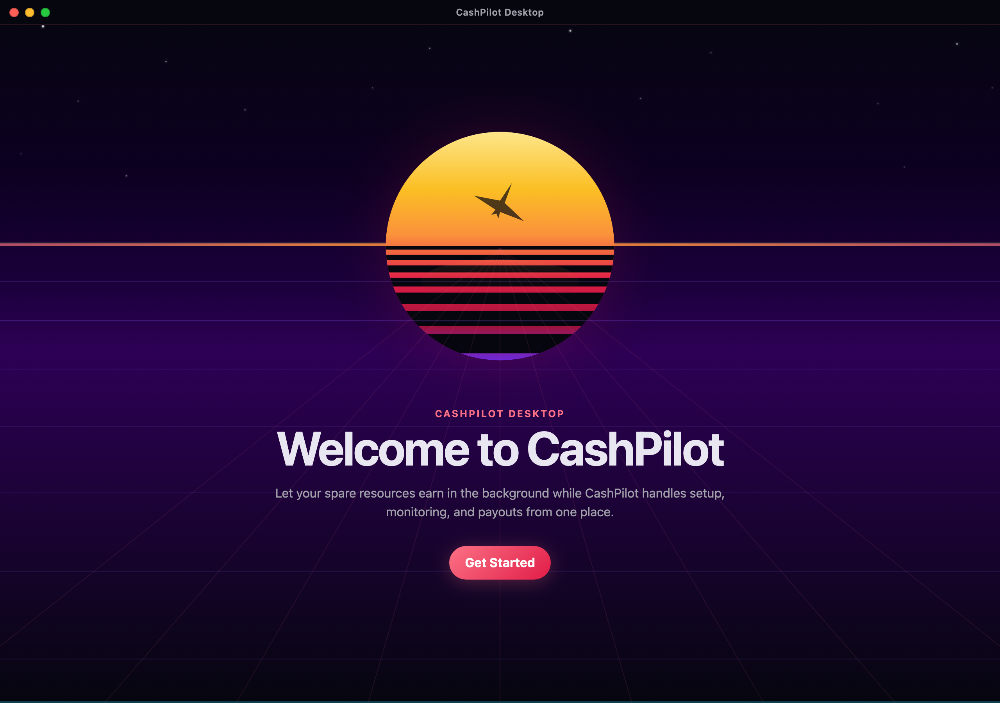
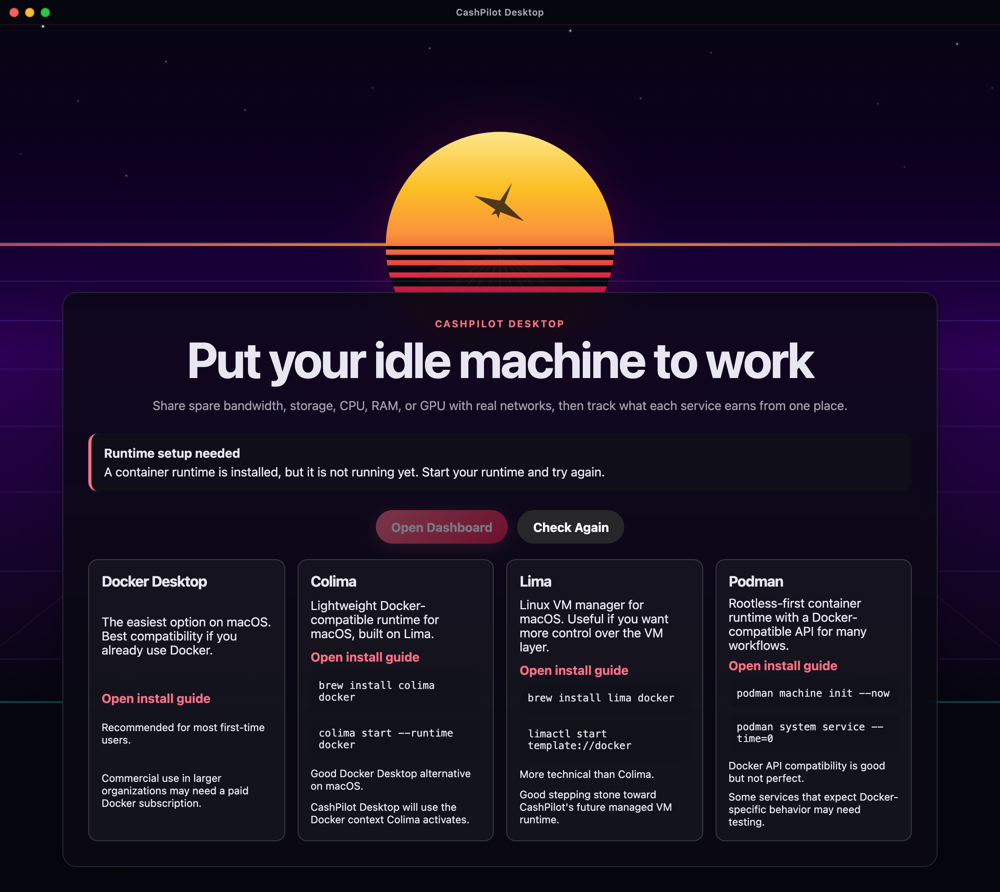
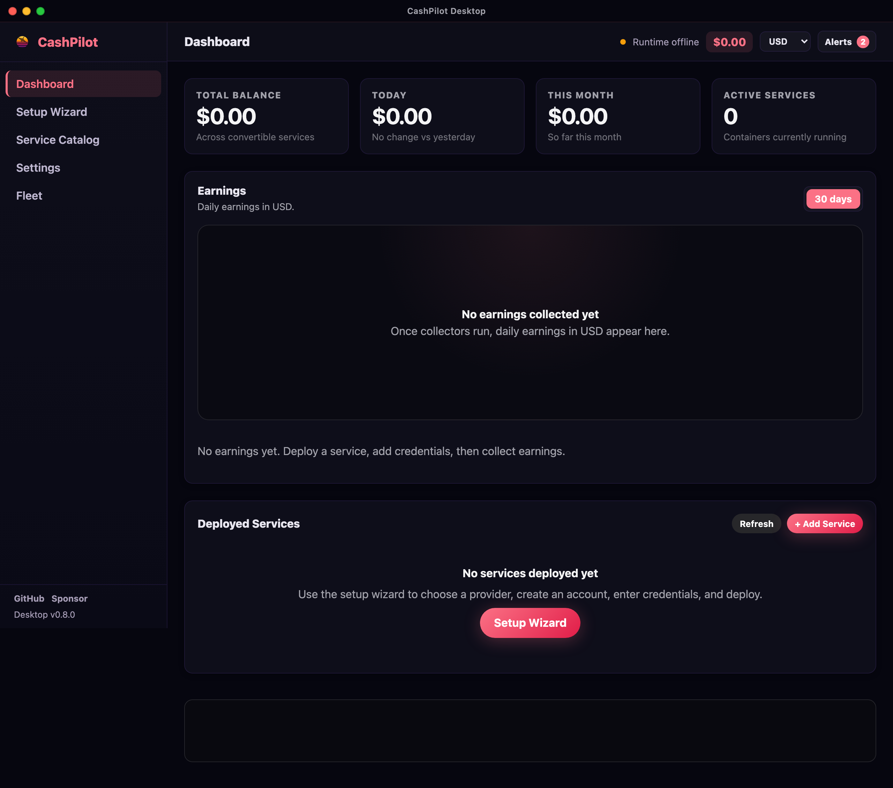
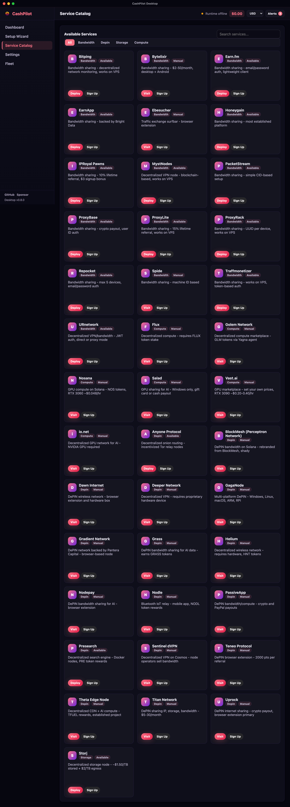
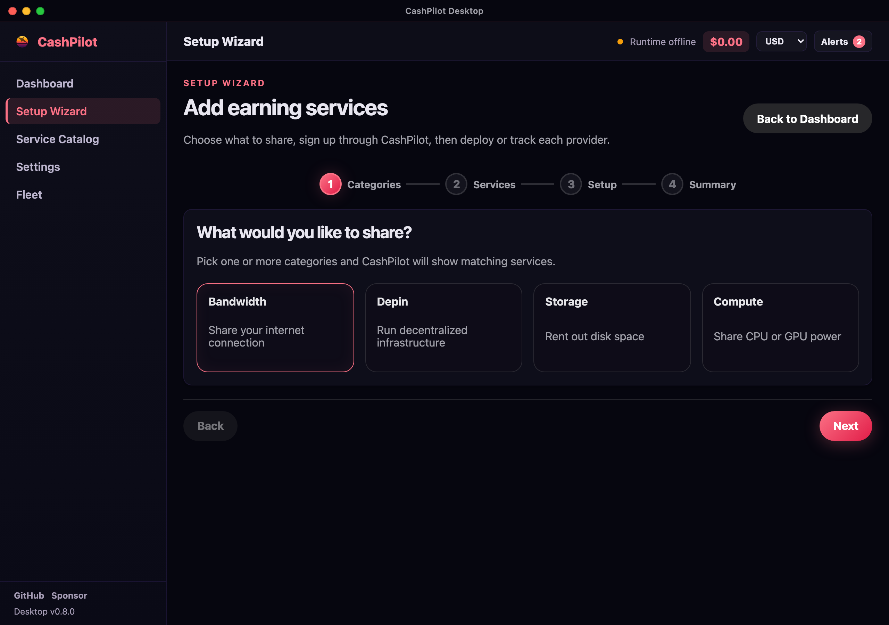
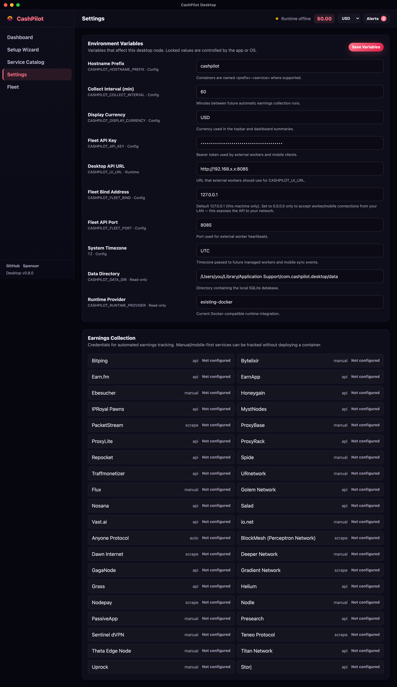
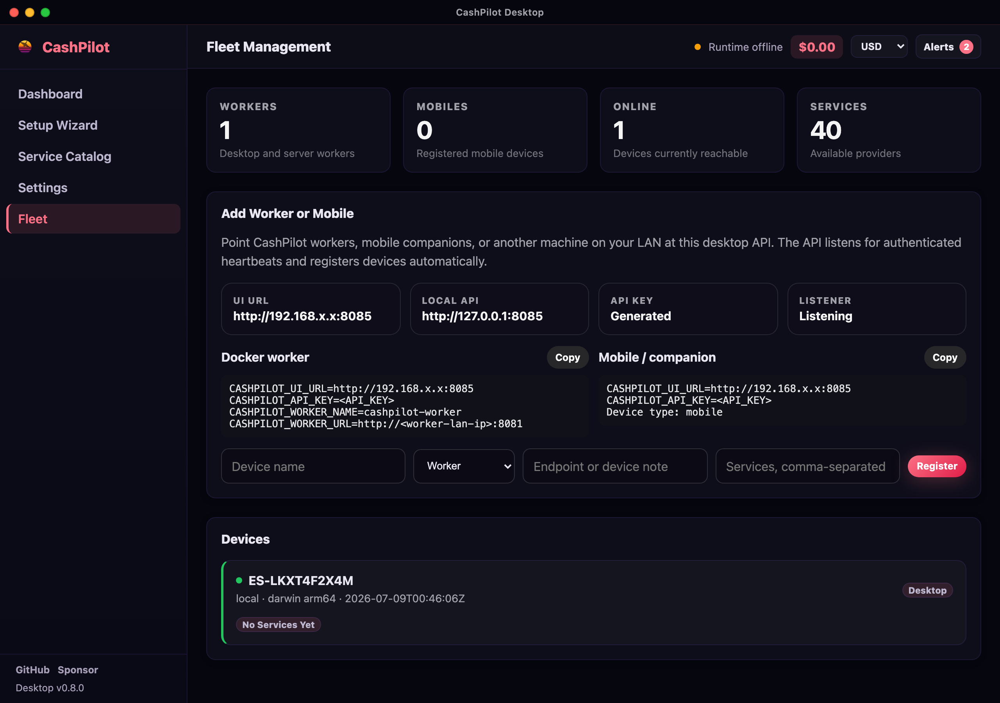

# CashPilot Desktop — Screenshots

A visual tour of the app (**v0.8.0**), captured from the running desktop build. No
service credentials are configured in these shots, so every screen shows the
clean first-run / empty state. Where a screen displayed a locally-generated API
token, a LAN IP, or a home path, those values are masked (`<API_KEY>`,
`192.168.x.x`, `/Users/you/`) — the loopback `127.0.0.1` is kept so the fleet/API
addresses stay accurate.

## Onboarding

First launch welcomes you and then checks for a container runtime, with
copy-paste install guides for Docker, Colima, Lima, and Podman across macOS,
Linux, and Windows.

## Dashboard

The home view: total balance, today's and this month's earnings, and active
service count across the top; a daily-earnings chart; and your deployed services.
Everything reads `$0.00` here because no collectors have run yet.

## Service Catalog

Browse the built-in catalog of passive-income and DePIN providers (bandwidth,
DePIN, storage, and compute), each with its earnings model, requirements, and a
one-click path into the setup wizard.

## Setup Wizard

A guided flow — pick categories, choose providers, enter credentials, and deploy —
so you don't have to hand-write container configs.

## Settings

Configure the display currency, collection interval, data retention, and per-service
credentials. Credentials are encrypted at rest with a master key held in the OS
keychain.

## Fleet

Run CashPilot across more than one machine: point workers or a mobile companion at
the desktop's loopback API and they register automatically. Silent devices are
flipped offline and long-dead ones are reaped, so the list stays honest.

