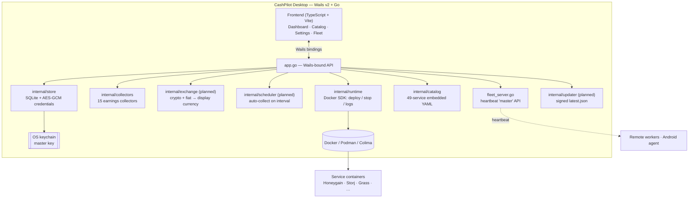

# CashPilot Desktop — Master Plan

> The plan of record for taking CashPilot Desktop from "works on the maintainer's machine" to a
> genuinely usable, signed, cross-platform passive‑income app that a non‑technical person can install and
> run. It confirms the architecture, sets the delivery order, and lists what expansion looks like.
>
> _Last updated: 2026-07-04_

## Executive summary

- **What it is today:** a Wails v2 + Go desktop app (v0.5.0) that detects a container runtime
  (Docker/Podman/Colima/Lima), deploys and manages passive‑income service containers, stores credentials
  encrypted with an OS‑keychain‑protected master key, and ships a **49‑service catalog** with **15 earnings
  collectors** already implemented. The container‑management core is solid and matches the CashPilot server.
- **The gap to "usable":** automatic (scheduled) earnings collection, correct multi‑currency earnings math,
  a real earnings dashboard, cross‑platform system tray + auto‑update, and **signed installers for
  macOS / Windows / Linux**. A large in‑progress feature branch (fleet server, settings, currency selector,
  new app shell) needs reconciling and landing.
- **The decision:** **stay on Wails v2 + Go.** (Reasoning below — the short version: it keeps ~3,400 lines
  of working Go, including the native Docker SDK integration and all 15 collectors, and every remaining gap
  is solved with focused work rather than a rewrite.)
- **How we prove it:** every slice is built and run on an always‑on **Apple‑Silicon Mac mini test bed**,
  driven remotely, with dated screenshots captured into `docs/` so progress is verifiable, not asserted.

## Confirmed architecture

**Stack:** Wails v2.12 + Go 1.26 · frontend in TypeScript + Vite · local SQLite (`modernc.org/sqlite`,
pure‑Go so cross‑compiles cleanly) with AES‑GCM‑encrypted credentials · **master key in the OS keychain**
(`zalando/go-keyring`: macOS Keychain, Windows Credential Manager, Linux Secret Service) · container control
through the **Docker SDK** (Docker / Podman / Colima / Lima).

**Key architectural choices:**

- **One source of truth for the catalog.** The service catalog is YAML, shared with the CashPilot server.
  The desktop embeds a vendored copy at build time (offline‑first) and a CI **parity test** keeps the copy
  honest and asserts every catalog collector slug has a matching Go collector (and vice‑versa). No runtime
  catalog download in the core path.
- **Collectors are Go re‑implementations** of the server's collectors — already at **15 = 15** parity — with
  a new `internal/exchange` service that normalizes mixed‑currency balances (crypto + fiat) to the user's
  display currency before any totals are shown.
- **Fleet = desktop‑as‑master.** The in‑progress `fleet_server.go` exposes a token‑authenticated heartbeat
  API compatible with the CashPilot server's worker protocol, so a real worker (or the Android agent) can
  report into the desktop. It binds to loopback by default and gains liveness + a remote‑command channel
  before it ships.
- **Signing and auto‑update are CI concerns**, not framework concerns — which is exactly why the framework
  choice below is not blocked by them.

### Why Wails, not Tauri

Switching to Tauri would discard the working Go backend (native Docker SDK, keychain, 15 collectors) for no
user‑facing gain. Code signing is done by `codesign` / `signtool` / `gpg` in CI regardless of framework, and
remote GUI testing is identical either way. Tauri's one real advantage — a built‑in signed updater — is
replaced by a single bounded `internal/updater` slice. A mid‑flight framework swap is not justified.

## Feature parity with the CashPilot server

The desktop collapses the server's UI + Worker split into one local process. Parity target:

| Capability | Server | Desktop plan |
|---|:--:|---|
| 49‑service YAML catalog (+ hot reload) | ✅ | **Have** (embedded) |
| 15 earnings collectors | ✅ | **Have** (all 15 ported) |
| Container deploy / stop / start / restart / remove / logs | ✅ (via worker) | **Have** — re‑pointed at **local Docker** |
| Encrypted credential storage | ✅ (Fernet) | **Have** (AES‑GCM + OS keychain) |
| Exchange‑rate conversion (crypto + fiat) | ✅ | **Add** — `internal/exchange` |
| Scheduled collection (auto, on interval) | ✅ | **Add** — `internal/scheduler` |
| Earnings summary (today / month / Δ), daily chart, per‑service breakdown | ✅ | **Add** |
| Signup‑bonus offsets · cashout eligibility | ✅ | **Add** (from catalog `cashout`) |
| Health scoring + collector‑failure alerts | ✅ | **Add** |
| Data‑retention purge | ✅ | **Add** |
| Compose export (for no‑runtime users) | ✅ | **Add** (monitor‑only mode) |
| Fleet / worker heartbeat | ✅ | **Adapt** — desktop‑as‑master |
| Multi‑user auth, RBAC, sessions, SSRF worker policy, fleet‑key | ✅ | **Drop** — server‑only (single local user) |

Bottom line: catalog + collectors + encrypted config are already at parity; the additive work is the
**earnings intelligence stack** (exchange rates, scheduler, summary/analytics, health) plus **packaging**.

## Delivery roadmap (dependency‑ordered)

Each slice is one research → implement → review iteration, independently shippable, verified live on the Mac
mini.

| # | Slice | Done when |
|---|---|---|
| **0** | **Reconcile the in‑progress branch into a compiling, tested baseline** — restore the app‑icon embed, land the fleet/settings/currency/app‑shell work, regenerate bindings, remove dead Tauri directories. | `go build`, `go test`, and `wails build` succeed on a clean checkout and the app launches. |
| **1** | **CI + parity guardrails** — build+test on every PR (not just tags); catalog‑sync + collector↔catalog parity test. | PR CI runs tests + build; parity test fails on drift, passes today. |
| **2** | **Exchange‑rate normalization** — `internal/exchange` (crypto→USD + USD→fiat, cached, stale‑graceful). | Mixed‑currency balances aggregate to one correct value in the selected currency. |
| **3** | **Earnings summary** — today / month / change‑%, per‑service payout‑progress bars, real daily chart. | Dashboard shows real figures (no placeholders) and payout‑progress per service. |
| **4** | **Scheduled collection + health/alerts** — background collection on interval; failing collectors raise visible alerts without poisoning balances. | Collectors run automatically; a failure shows an alert. |
| **5** | **Lifecycle & credential UX** — logs modal, clear/update credentials, manual‑vs‑Docker service distinction, **per‑service "use your own referral code" override**. | Users can manage logs/credentials/referrals from the UI. |
| **6** | **Monitor‑only mode + compose export** — value even without a working runtime. | No‑runtime users can browse the catalog and export a valid `docker-compose.yml`. |
| **7** | **Fleet finish** — heartbeat liveness/offline sweep + outbound remote‑deploy command. | A stale worker flips offline; the desktop can deploy to a connected worker. |
| **8** | **Cross‑platform packaging + code signing** — macOS notarized `.dmg`, Windows signed NSIS installer, Linux AppImage/`.deb` with GPG + `SHA256SUMS`. | A tagged release attaches signed installers for all three OSes. |
| **9** | **Cross‑platform auto‑updater** — `internal/updater`: signed `latest.json`, verify, swap, relaunch. | An older install detects, applies, and relaunches on a newer signed release. |
| **10** | **Service + category expansion** (research‑driven, ongoing) — vetted new services/categories with parity preserved. | New vetted services load, the Docker ones deploy, parity check still passes. |

## Catalog expansion

The catalog already covers essentially the entire Docker "proxyware" market (the two canonical aggregator
projects contribute nothing not already present). Future value is in **DePIN / CDN / compute**, not more
bandwidth resellers:

- **New category — Decentralized CDN / edge** (`cdn`): **Pipe Network** (mainnet, headless, disk+bandwidth,
  has a referral program), plus Fleek and Filecoin Saturn for prosumers. This is the one genuinely new
  workload class (you serve/cache content, not just proxy an IP).
- **Broaden storage:** **Sia** (`hostd`, Docker, headless) alongside Storj — lowest‑friction add.
- **Broaden compute:** **Akash** (runs any Docker container) and **GaiaNet** — the largest real‑revenue
  DePIN segment, GPU‑gated so ranked after the above.
- **Bandwidth:** **Castar SDK** is the only clean new drop‑in matching the existing pattern.

Each addition ships as vetted catalog YAML (with a collector where an official API exists) and is upstreamed
to the shared catalog so server/desktop stay in parity.

## Packaging, signing & auto‑update

- **macOS:** Developer ID codesign under hardened runtime (a minimal entitlements set — WKWebView needs no
  JIT entitlements), `notarytool submit --wait`, `stapler staple`, packaged and stapled as a `.dmg`.
- **Windows:** **SignPath.io Foundation** (free for open‑source) signs the NSIS installer in CI via its
  GitHub Action. Note: EV certificates no longer buy instant SmartScreen trust — reputation now accrues per
  publisher over time — so the free path gives the same end result at zero cost.
- **Linux:** AppImage (+ optional `.deb`) with a GPG signature and `SHA256SUMS`.
- **Auto‑update:** a Go updater fetches a **signed** `latest.json` from GitHub Releases, semver‑compares
  against `wails.json`, verifies checksum + signature, and applies per‑OS. Critical constraint: on macOS the
  **entire `.app` bundle** is swapped (never the inner binary) so the notarization ticket stays valid.

## Trust & honesty commitments (pro‑user)

These make the app safe and honest for the person running it, and are part of the roadmap above:

- **Own‑referral override** (Slice 5): a first‑run choice to keep the maintainer's referral codes (which
  support development) or enter your own, with the README aligned to what the app actually does.
- **Per‑IP conflict warnings:** when two or more enabled services are "1 device per IP" (e.g. Honeygain,
  EarnApp, IPRoyal), warn instead of implying they stack — earnings are gated per IP.
- **Plain‑language consent** at first run: sharing home bandwidth may conflict with an ISP's terms and lets
  third parties route traffic through your IP; nothing auto‑starts without acknowledgement.
- **Container hardening invariants:** no `privileged`, no host networking except where a service genuinely
  requires it (flagged prominently), image digests pinned, never mount the Docker socket into a service.
- **Honest earnings:** realistic per‑device ranges and payout thresholds; dead/broken services filtered.

## Live test bed (Mac mini)

An always‑on Apple‑Silicon Mac mini (16 GB / 10 cores, fast NVMe, full Xcode, Colima + Docker) is the
verification surface. Each build is deployed there, driven remotely, and screenshotted into `docs/`. Real
service credentials from the existing CashPilot deployment are imported for realistic earnings testing. This
is what makes "genuinely usable" checkable rather than claimed.

## What we need from the maintainer (human‑decision items)

Tracked in more detail alongside this plan; none block the early slices:

1. **Windows signing:** approve pursuing **SignPath Foundation** — it needs one published (unsigned) release
   first, then an application at signpath.org, then a single CI token added as a secret. No cost, no
   hardware.
2. **macOS signing:** confirm which Developer ID Application certificate/team to use and provide the CI
   secrets (certificate `.p12` + App Store Connect API key). Needed for Slice 8, not before.
3. **Referral policy:** confirm the default — keep the maintainer's referral codes as an opt‑in default
   (recommended, matches peer projects) with a per‑service override.

## Differentiation (the moat)

CashPilot Desktop is the **only signed, native, one‑click GUI** aggregator — every comparable multi‑service
tool requires Docker and a terminal. Combined with the **broadest curated catalog** (bandwidth + DePIN +
compute + storage, with residential/VPS and per‑IP metadata) and an **ecosystem** no competitor has
(fleet/worker orchestration, Android agent, MCP server, Home Assistant, n8n), the strategy is to protect
that "your parents could use it" position while adding the earnings‑intelligence and packaging work above.
